# Part 2: Programming Fundamentals

> **Duration:** 6-8 Weeks | **Difficulty:** Beginner to Intermediate | **Prerequisites:** Basic computer literacy, access to a code editor (VS Code recommended)

---

## Overview

Part 2 lays the intellectual foundation for all software development. Before you write a single line of production code, you must learn *how to think* like a programmer. This part covers computational thinking, algorithmic analysis, recursion, clean code practices, the SOLID object-oriented design principles, and the canonical design patterns that appear in virtually every codebase.

By the end of Part 2, you will be able to analyze the efficiency of algorithms, write maintainable code that follows industry standards, and apply proven design patterns to solve recurring problems.

---

## Table of Contents

- [Chapter 1: Programming Logic & Problem Solving](#chapter-1-programming-logic--problem-solving)
- [Chapter 2: Complexity Analysis & Big O](#chapter-2-complexity-analysis--big-o)
- [Chapter 3: Recursion](#chapter-3-recursion)
- [Chapter 4: Clean Code & Best Practices](#chapter-4-clean-code--best-practices)
- [Chapter 5: SOLID Principles](#chapter-5-solid-principles)
- [Chapter 6: Design Patterns](#chapter-6-design-patterns)

---

## Chapter 1: Programming Logic & Problem Solving

### Introduction

Programming is not about knowing syntax — it is about **solving problems systematically**. This chapter teaches you the fundamental thinking framework that separates seasoned engineers from beginners. You will learn how to decompose complex problems, recognize patterns, design algorithms, and express solutions in pseudocode and flowcharts before writing a single line of code.

### Why It Matters

> ✅ **Best Practice:** Spend 70% of your time thinking and designing before you write code. The best programmers write less code because they think more.

Every interview, every feature implementation, and every debugging session relies on structured problem-solving. Companies like Google, Amazon, and Microsoft explicitly test these skills in technical interviews.

### Real World Analogy: Cooking a New Recipe

When you cook a new dish:
1. **Decomposition** — You break the recipe into steps: prep ingredients, cook base, add seasoning, plate.
2. **Pattern Recognition** — You notice that searing meat is similar across multiple recipes.
3. **Abstraction** — You learn the general concept of "browning" without caring about the specific pan or stove.
4. **Algorithm Design** — You sequence the steps in the correct order (you can't plate before cooking).

Programming follows exactly this mental model.

### Theory: Computational Thinking

Computational thinking consists of four pillars:

#### 1. Decomposition

Breaking a complex problem into smaller, manageable sub-problems.

**Example:** Building a Twitter clone → decompose into:
- User authentication
- Posting tweets
- Following users
- Timeline generation
- Notifications

Each sub-problem can be solved independently.

#### 2. Pattern Recognition

Identifying similarities between problems to reuse solutions.

**Example:** A search bar, a product filter, and a contact list all share the same "filter a list by user input" pattern.

#### 3. Abstraction

Hiding implementation details and exposing only what is necessary.

**Example:** You call `sort(array)` without caring whether it uses QuickSort or MergeSort internally.

```java
// Abstraction example — the user of this method doesn't need to know how sorting works
public interface Sorter {
    void sort(int[] array);
}

// Internal implementation is hidden
public class QuickSorter implements Sorter {
    public void sort(int[] array) {
        // QuickSort algorithm — details hidden from caller
        quickSort(array, 0, array.length - 1);
    }
}
```

#### 4. Algorithm Design

Creating a step-by-step solution that can be executed mechanically.

### Problem-Solving Framework

Use this five-step framework for ANY coding problem:

```
1. UNDERSTAND  → 2. PLAN  → 3. EXECUTE  → 4. VERIFY  → 5. REFINE
```

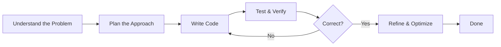

**Step 1: Understand**
- Restate the problem in your own words
- Identify inputs, outputs, and constraints
- Ask clarifying questions
- Work through small examples manually

**Step 2: Plan**
- Choose a strategy (brute force first, optimize later)
- Write pseudocode
- Draw a flowchart for complex logic
- Identify edge cases

**Step 3: Execute**
- Write clean, readable code
- Follow language conventions
- Add comments only where logic is non-obvious

**Step 4: Verify**
- Test with sample inputs
- Test edge cases (empty, null, max values, duplicates)
- Trace through the code mentally

**Step 5: Refine**
- Analyze time and space complexity
- Look for optimizations
- Consider alternative approaches

### What is an Algorithm?

An **algorithm** is a finite sequence of well-defined instructions to solve a problem.

**Properties of a good algorithm:**
- **Correct** — Produces the right output for all valid inputs
- **Finite** — Terminates after a finite number of steps
- **Definite** — Each step is unambiguous
- **Effective** — Each step is feasible
- **Input/Output** — Takes input and produces output

### Flowcharts

Flowcharts visually represent algorithms using standardized symbols.

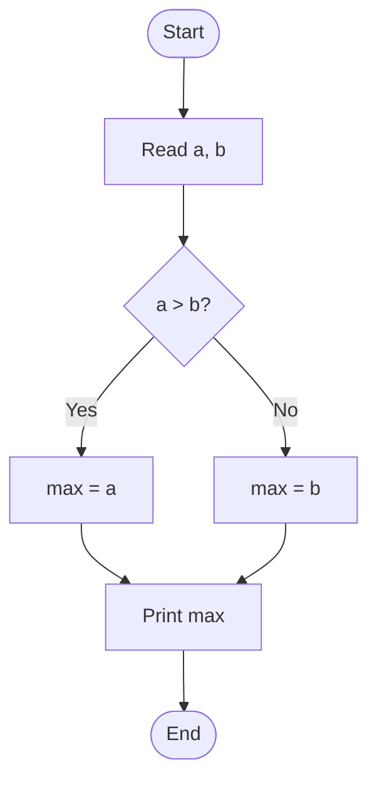

**Common flowchart symbols:**

| Symbol | Name | Purpose |
|--------|------|---------|
| Oval | Terminator | Start / End |
| Parallelogram | Input/Output | Read / Print |
| Rectangle | Process | Computation |
| Diamond | Decision | Yes / No branch |
| Arrow | Flow Line | Direction |

### Pseudocode

Pseudocode bridges the gap between human language and code. It is language-agnostic.

**Example: Linear Search**

```
ALGORITHM LinearSearch(array, target)
    FOR each element in array
        IF element == target THEN
            RETURN index of element
        END IF
    END FOR
    RETURN -1  // not found
END ALGORITHM
```

**Java Implementation:**
```java
public class LinearSearch {
    public static int linearSearch(int[] arr, int target) {
        for (int i = 0; i < arr.length; i++) {
            if (arr[i] == target) {
                return i;  // found at index i
            }
        }
        return -1;  // not found
    }

    public static void main(String[] args) {
        int[] numbers = {4, 2, 7, 1, 9, 3};
        int result = linearSearch(numbers, 7);
        System.out.println("Found at index: " + result);  // Output: 2
    }
}
```

**Python Implementation:**
```python
def linear_search(arr, target):
    for i, element in enumerate(arr):
        if element == target:
            return i  # found at index i
    return -1  # not found

numbers = [4, 2, 7, 1, 9, 3]
result = linear_search(numbers, 7)
print(f"Found at index: {result}")  # Output: 2
```

**Example: Binary Search (on sorted array)**

```
ALGORITHM BinarySearch(sortedArray, target)
    left = 0
    right = length(sortedArray) - 1

    WHILE left <= right
        mid = floor((left + right) / 2)

        IF sortedArray[mid] == target THEN
            RETURN mid
        ELSE IF sortedArray[mid] < target THEN
            left = mid + 1
        ELSE
            right = mid - 1
        END IF
    END WHILE

    RETURN -1
END ALGORITHM
```

```java
public class BinarySearch {
    public static int binarySearch(int[] arr, int target) {
        int left = 0, right = arr.length - 1;

        while (left <= right) {
            int mid = left + (right - left) / 2;  // avoids overflow

            if (arr[mid] == target) return mid;
            else if (arr[mid] < target) left = mid + 1;
            else right = mid - 1;
        }
        return -1;
    }

    public static void main(String[] args) {
        int[] sorted = {1, 3, 5, 7, 9, 11, 13};
        System.out.println(binarySearch(sorted, 7));  // 3
        System.out.println(binarySearch(sorted, 2));  // -1
    }
}
```

```python
def binary_search(arr, target):
    left, right = 0, len(arr) - 1

    while left <= right:
        mid = left + (right - left) // 2  # avoids overflow

        if arr[mid] == target:
            return mid
        elif arr[mid] < target:
            left = mid + 1
        else:
            right = mid - 1
    return -1

sorted_arr = [1, 3, 5, 7, 9, 11, 13]
print(binary_search(sorted_arr, 7))  # 3
print(binary_search(sorted_arr, 2))  # -1
```

### Common Mistakes

> ⚠️ **Warning:** The most common mistake beginners make is **writing code before understanding the problem**. Always solve the problem on paper first.

| Mistake | Why It's Harmful | Solution |
|---------|-----------------|----------|
| Jumping to code immediately | Misses edge cases, wasted effort | Spend time planning first |
| Skipping edge cases | Crashes in production | Always test empty/null/max inputs |
| Using complex logic early | Hard to debug, harder to maintain | Start brute-force, then optimize |
| Not tracing through examples | Hidden bugs | Trace manually with sample data |
| Ignoring constraints | Wrong approach chosen | Consider time/space limits first |

### Best Practices

- ✅ Write pseudocode before actual code for any non-trivial algorithm
- ✅ Draw flowcharts for complex conditional logic
- ✅ Start with the simplest working solution (brute force), then optimize
- ✅ Name variables and functions clearly based on the problem domain
- ✅ Test with the smallest possible input first

### Interview Questions

> ❓ **Interview Question:** "Write a function that takes an array of integers and returns the two numbers that sum to a target value."

**Approach discussion:**
1. **Brute force:** Nested loops — O(n²) time, O(1) space
2. **Hash map:** Single pass — O(n) time, O(n) space
3. **Two-pointer (sorted):** Sort + two pointers — O(n log n) time, O(1) space

```java
import java.util.HashMap;
import java.util.Map;

public class TwoSum {
    // Optimal: Hash map approach — O(n) time, O(n) space
    public static int[] twoSum(int[] nums, int target) {
        Map<Integer, Integer> map = new HashMap<>();

        for (int i = 0; i < nums.length; i++) {
            int complement = target - nums[i];
            if (map.containsKey(complement)) {
                return new int[]{map.get(complement), i};
            }
            map.put(nums[i], i);
        }
        return new int[]{-1, -1};  // no solution
    }
}
```

> ❓ **Interview Question:** "How would you find the first non-repeating character in a string?"

### Practical Exercises

1. **FizzBuzz:** Print 1 to 100, replacing multiples of 3 with "Fizz", 5 with "Buzz", and both with "FizzBuzz"
2. **Palindrome Checker:** Determine if a string reads the same forwards and backwards
3. **Anagram Detector:** Check if two strings are anagrams of each other
4. **Array Rotation:** Rotate an array by k positions
5. **Valid Parentheses:** Check if brackets `()`, `{}`, `[]` in a string are properly matched

### Mini Project: Word Frequency Analyzer

Build a program that reads a text file and outputs the top N most frequent words.

```python
import re
from collections import Counter

def analyze_word_frequency(file_path, top_n=10):
    with open(file_path, 'r', encoding='utf-8') as file:
        text = file.read().lower()

    words = re.findall(r'\b\w+\b', text)
    stop_words = {'the', 'a', 'an', 'and', 'or', 'but', 'in', 'on', 'at', 'to', 'for', 'is', 'was'}

    filtered_words = [w for w in words if w not in stop_words]
    word_counts = Counter(filtered_words)

    print(f"{'Word':<15} {'Count':<5}")
    print("-" * 20)
    for word, count in word_counts.most_common(top_n):
        print(f"{word:<15} {count:<5}")

analyze_word_frequency('sample.txt', top_n=10)
```

### Revision Notes

- Computational thinking = Decomposition + Pattern Recognition + Abstraction + Algorithm Design
- Always follow: Understand → Plan → Execute → Verify → Refine
- Flowcharts visualize algorithm flow; use them for complex branching
- Pseudocode is language-agnostic algorithmic description
- Start brute force, then optimize — don't optimize prematurely

---

## Chapter 2: Complexity Analysis & Big O

### Introduction

Big O notation is the language we use to describe how efficient an algorithm is. As your data grows, will your program slow to a crawl? Complexity analysis answers this question mathematically without needing to run code.

### Why It Matters

> ✅ **Best Practice:** Always state the time and space complexity when presenting a solution in an interview. It shows you care about efficiency.

- **System design:** Choosing the wrong algorithm at scale costs millions in infrastructure
- **Interviews:** Nearly every technical interview asks you to analyze complexity
- **Performance debugging:** You need to know *why* a query or function is slow

### Real World Analogy: Shipping Packages

- **O(1):** A vending machine — takes the same time regardless of how many items are inside
- **O(n):** Checking luggage at an airport — linear with number of passengers
- **O(n²):** A high school dance where everyone must dance with everyone else — the time grows quadratically
- **O(log n):** Finding a name in a phone book — halving the search space each step
- **O(2ⁿ):** Trying every possible combination for a suitcase lock — grows explosively

### Theory: What is Big O?

Big O notation describes the **upper bound** of an algorithm's growth rate as the input size approaches infinity. It focuses on the **dominant term** and drops constants.

**Formal definition:** f(n) = O(g(n)) if there exist positive constants c and n₀ such that 0 ≤ f(n) ≤ c·g(n) for all n ≥ n₀.

In practice, it answers: "How does the runtime change as the input gets larger?"

### Internal Working: Growth Rates Visualized

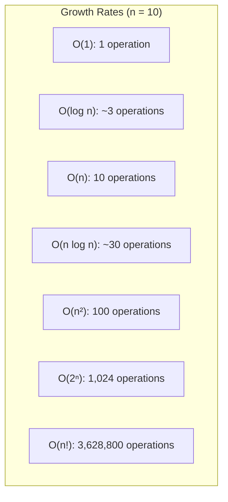

| Notation | Name | n=10 | n=100 | n=1000 | Example |
|----------|------|------|-------|--------|---------|
| O(1) | Constant | 1 | 1 | 1 | Array access by index |
| O(log n) | Logarithmic | ~3 | ~7 | ~10 | Binary search |
| O(n) | Linear | 10 | 100 | 1000 | Linear search |
| O(n log n) | Linearithmic | ~30 | ~700 | ~10000 | Merge Sort |
| O(n²) | Quadratic | 100 | 10000 | 1,000,000 | Bubble Sort |
| O(2ⁿ) | Exponential | 1,024 | 1.27e30 | — | Fibonacci (naive) |
| O(n!) | Factorial | 3.6M | — | — | Traveling Salesman (brute) |

### Analyzing Algorithms Step-by-Step

**Step 1:** Identify the input size (n)
**Step 2:** Count the number of basic operations
**Step 3:** Drop constants and lower-order terms

**Example: Analyzing a loop**

```java
public void printPairs(int[] arr) {
    // Outer loop: runs n times
    for (int i = 0; i < arr.length; i++) {
        // Inner loop: runs n times
        for (int j = 0; j < arr.length; j++) {
            System.out.println(arr[i] + ", " + arr[j]);
        }
    }
}
```

**Analysis:**
- Outer loop: n iterations
- Inner loop: n iterations for each outer
- Total operations: n × n = n²
- Complexity: **O(n²)**

### Common Data Structure Complexities

#### Array Operations

| Operation | Time Complexity |
|-----------|----------------|
| Access by index | O(1) |
| Search (unsorted) | O(n) |
| Search (sorted, binary) | O(log n) |
| Insert at beginning | O(n) |
| Insert at end | O(1)* |
| Delete at beginning | O(n) |
| Delete at end | O(1)* |

\* Amortized — may require occasional resizing

#### HashMap / HashSet Operations

| Operation | Average | Worst |
|-----------|---------|-------|
| Get | O(1) | O(n) |
| Put | O(1) | O(n) |
| Contains | O(1) | O(n) |
| Delete | O(1) | O(n) |

> ⚠️ **Warning:** Worst-case O(n) for hash-based structures occurs when hash collisions are high. A good hash function makes this extremely rare.

#### Tree Operations (Balanced BST)

| Operation | Average | Worst |
|-----------|---------|-------|
| Search | O(log n) | O(n) |
| Insert | O(log n) | O(n) |
| Delete | O(log n) | O(n) |

#### Graph Operations

| Operation | Adjacency Matrix | Adjacency List |
|-----------|-----------------|----------------|
| Add vertex | O(V²) | O(1) |
| Add edge | O(1) | O(1) |
| Remove edge | O(1) | O(V) |
| Check edge | O(1) | O(V) |
| BFS/DFS | O(V²) | O(V + E) |

### Best, Average, and Worst Cases

| Algorithm | Best | Average | Worst |
|-----------|------|---------|-------|
| Quick Sort | O(n log n) | O(n log n) | O(n²) |
| Merge Sort | O(n log n) | O(n log n) | O(n log n) |
| Linear Search | O(1) | O(n) | O(n) |
| Binary Search | O(1) | O(log n) | O(log n) |
| Hash Insert | O(1) | O(1) | O(n) |

> ✅ **Best Practice:** Always optimize for the **average case** unless your system must guarantee response times under all conditions (real-time systems optimize for worst case).

### Space Complexity

Space complexity measures the total memory an algorithm uses relative to the input size.

**Components:**
- **Input space:** Memory for the inputs
- **Auxiliary space:** Extra memory (temporary variables, recursion stack, data structures)
- **Total space = Input space + Auxiliary space** (usually only auxiliary space is analyzed)

```java
// O(1) auxiliary space — only a single integer variable
public int sum(int[] arr) {
    int total = 0;          // auxiliary: O(1)
    for (int val : arr) {
        total += val;
    }
    return total;
}

// O(n) auxiliary space — creates a new array
public int[] doubleArray(int[] arr) {
    int[] result = new int[arr.length];  // auxiliary: O(n)
    for (int i = 0; i < arr.length; i++) {
        result[i] = arr[i] * 2;
    }
    return result;
}

// O(n²) auxiliary space — creates a 2D matrix
public int[][] multiplicationTable(int n) {
    int[][] table = new int[n][n];  // auxiliary: O(n²)
    for (int i = 0; i < n; i++) {
        for (int j = 0; j < n; j++) {
            table[i][j] = (i + 1) * (j + 1);
        }
    }
    return table;
}
```

### Common Mistakes

| Mistake | Example | Why Wrong |
|---------|---------|-----------|
| Dropping the wrong term | O(n + n²) → O(n) | Must keep the largest term: O(n²) |
| Ignoring constant factors in loops | Two separate O(n) loops called O(n²) | Two O(n) loops = O(2n) → O(n) |
| Confusing O(log n) with O(n) | Assuming binary search is O(n) | `log₂ 1,000,000 ≈ 20` — dramatically faster |
| Forgetting about recursion stack | Saying recursion is O(1) space | Recursion depth = n → O(n) stack space |
| Ignoring input size | Saying single operation is always O(1) | Depends on what the operation is |

### Best Practices

- ✅ Always state time and space complexity together: `O(n) time, O(1) space`
- ✅ Consider both average and worst-case scenarios
- ✅ Use Big O for upper bounds, Big Ω for lower bounds, Big Θ for tight bounds
- ✅ When in doubt, trace through small examples to count operations
- ✅ Remember that recursion adds stack space to your complexity

### Interview Questions

> ❓ **Interview Question:** "What is the time complexity of the following code?"

```java
for (int i = 0; i < n; i++) {
    for (int j = i; j < n; j++) {
        System.out.println(i + ", " + j);
    }
}
```

**Answer:** The inner loop runs n + (n-1) + (n-2) + ... + 1 = n(n+1)/2 = **O(n²)**

> ❓ **Interview Question:** "Design an algorithm with O(1) time complexity to find the minimum element in a stack."

**Hint:** Use an auxiliary stack that tracks the minimum at each level.

### Practical Exercises

1. Analyze the complexity of nested loops with different bounds
2. Given an array, find the missing number from 1 to n — solve in O(n) time, O(1) space
3. Implement a function and calculate its complexity from first principles
4. Compare empirical runtime of O(n), O(n log n), and O(n²) algorithms on large inputs

### Mini Project: Algorithm Performance Benchmark

```python
import time
import random
import matplotlib.pyplot as plt

def benchmark(func, sizes):
    times = []
    for n in sizes:
        data = [random.randint(1, 1000) for _ in range(n)]

        start = time.perf_counter()
        func(data.copy())
        end = time.perf_counter()

        times.append(end - start)
    return times

# Define three algorithms with different complexities
def o_n_algorithm(arr):
    total = 0
    for x in arr:
        total += x
    return total

def o_nlogn_algorithm(arr):
    return sorted(arr)

def o_n2_algorithm(arr):
    for i in range(len(arr)):
        for j in range(len(arr)):
            _ = arr[i] + arr[j]

sizes = [100, 200, 400, 800, 1600]

print("Benchmarking algorithms...")
print(f"{'n':<10} {'O(n)':<15} {'O(n log n)':<15} {'O(n²)':<15}")
print("-" * 55)

for n in sizes:
    data = [random.randint(1, 1000) for _ in range(n)]

    start = time.perf_counter()
    o_n_algorithm(data.copy())
    t1 = time.perf_counter() - start

    start = time.perf_counter()
    o_nlogn_algorithm(data.copy())
    t2 = time.perf_counter() - start

    start = time.perf_counter()
    o_n2_algorithm(data.copy())
    t3 = time.perf_counter() - start

    print(f"{n:<10} {t1:<15.6f} {t2:<15.6f} {t3:<15.6f}")
```

### Revision Notes

- Big O describes upper bound growth rate as n → ∞
- O(1) < O(log n) < O(n) < O(n log n) < O(n²) < O(2ⁿ) < O(n!)
- Drop constants and non-dominant terms
- Always consider both time and space complexity
- Recursive algorithms have stack depth in space complexity
- Worst-case is often the most important for interviews

---

## Chapter 3: Recursion

### Introduction

Recursion is a technique where a function calls itself to solve a problem by breaking it into smaller instances of the same problem. It is one of the most elegant and mind-bending concepts in programming.

### Why It Matters

- **Tree and graph traversal** (file systems, DOM, JSON) inherently use recursion
- **Divide-and-conquer algorithms** (Merge Sort, Quick Sort) rely on recursion
- **Functional programming** uses recursion instead of loops
- **Interviews** frequently test recursive thinking (backtracking, DFS, permutations)

### Real World Analogy: Russian Nesting Dolls

A Russian nesting doll (matryoshka) contains a smaller version of itself inside. To get to the smallest doll, you keep opening the outer doll until you reach the base case (the smallest doll that doesn't open). Then you close them back up in reverse order.

### Theory: Recursion Fundamentals

Every recursive function has two essential parts:

1. **Base case** — The condition under which the function stops recursing
2. **Recursive case** — The function calls itself with a smaller/simpler input

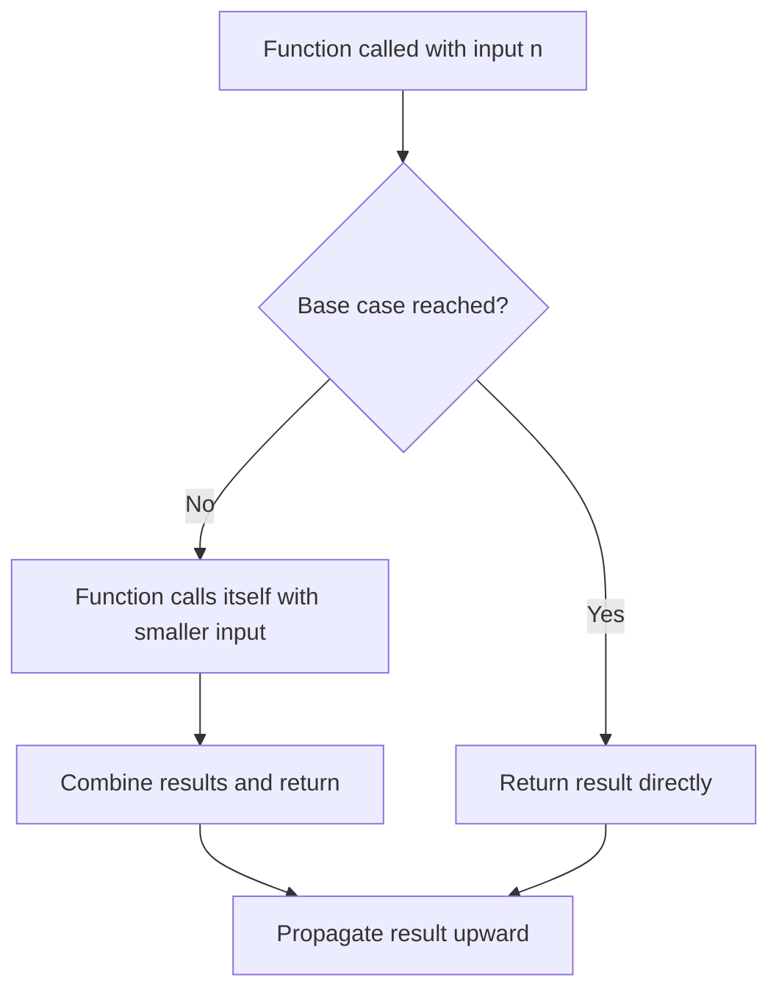

```java
public class RecursionBasics {
    // Factorial: n! = n * (n-1)!
    public static int factorial(int n) {
        // Base case
        if (n <= 1) return 1;
        // Recursive case
        return n * factorial(n - 1);
    }

    public static void main(String[] args) {
        System.out.println(factorial(5));  // 120
    }
}
```

```python
def factorial(n):
    # Base case
    if n <= 1:
        return 1
    # Recursive case
    return n * factorial(n - 1)

print(factorial(5))  # 120
```

### Internal Working: Call Stack Visualization

When `factorial(3)` is called:

```
Call Stack (grows downward):

factorial(1) → returns 1
factorial(2) → waiting for factorial(1)
factorial(3) → waiting for factorial(2)
main()      → waiting for factorial(3)

Return sequence:

factorial(1) = 1
factorial(2) = 2 * 1 = 2
factorial(3) = 3 * 2 = 6
main() receives 6
```

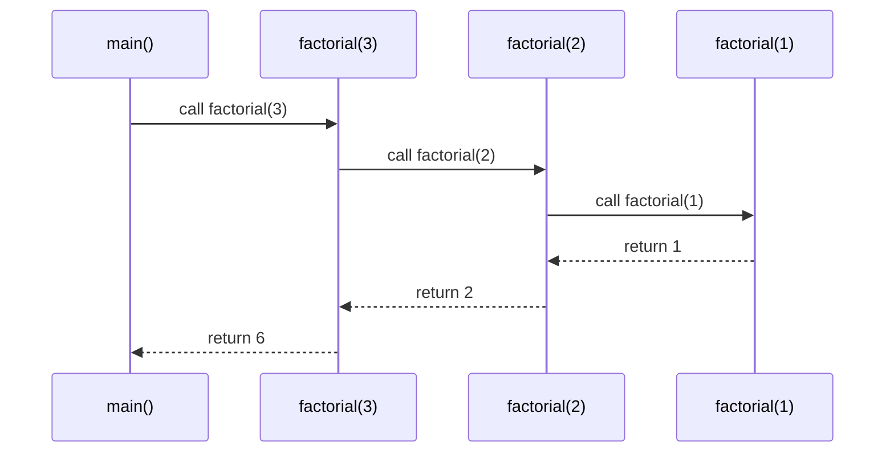

### Types of Recursion

#### 1. Linear Recursion

Each function makes at most one recursive call.

```java
// Linear recursion: prints countdown from n to 1
public void countdown(int n) {
    if (n <= 0) return;       // base case
    System.out.println(n);     // process
    countdown(n - 1);          // single recursive call
}
```

#### 2. Tail Recursion

The recursive call is the **last operation** in the function. Some compilers optimize this into a loop (tail-call optimization).

```java
// Tail-recursive factorial
public int factorialTail(int n, int accumulator) {
    if (n <= 1) return accumulator;
    return factorialTail(n - 1, n * accumulator);  // tail call
}

// Call: factorialTail(5, 1)
```

```python
# Python does NOT optimize tail recursion
def factorial_tail(n, accumulator=1):
    if n <= 1:
        return accumulator
    return factorial_tail(n - 1, n * accumulator)

# Still uses O(n) stack space in Python
```

#### 3. Binary Recursion

The function makes **two recursive calls** in the recursive case.

```java
// Naive Fibonacci — classic example of binary recursion
public static int fib(int n) {
    if (n <= 1) return n;                    // base case
    return fib(n - 1) + fib(n - 2);          // TWO recursive calls
}
```

#### 4. Nested Recursion

The argument to the recursive call is itself a recursive call.

```java
// McCarthy 91 function — example of nested recursion
public static int mcCarthy91(int n) {
    if (n > 100) return n - 10;
    return mcCarthy91(mcCarthy91(n + 11));  // nested recursive call
}
```

### Memoization: Optimizing Recursion

Naive recursion often recomputes the same values repeatedly. Memoization caches results to avoid this.

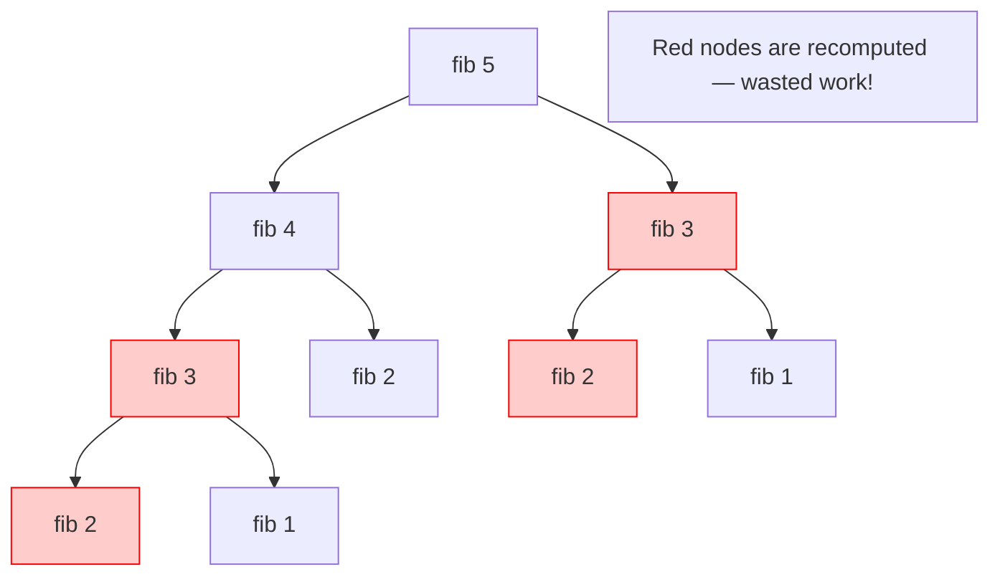

**Without memoization:** O(2ⁿ) time
**With memoization:** O(n) time

```java
import java.util.HashMap;
import java.util.Map;

public class FibonacciMemoized {
    private Map<Integer, Long> memo = new HashMap<>();

    public long fib(int n) {
        if (n <= 1) return n;

        // Check cache first
        if (memo.containsKey(n)) return memo.get(n);

        // Compute and cache
        long result = fib(n - 1) + fib(n - 2);
        memo.put(n, result);
        return result;
    }

    public static void main(String[] args) {
        FibonacciMemoized fm = new FibonacciMemoized();
        System.out.println(fm.fib(50));  // 12586269025 — instant!
    }
}
```

```python
from functools import lru_cache

@lru_cache(maxsize=None)
def fib(n):
    if n <= 1:
        return n
    return fib(n - 1) + fib(n - 2)

print(fib(50))  # 12586269025

# lru_cache automatically memoizes
```

### Recursion vs Iteration

| Aspect | Recursion | Iteration |
|--------|-----------|-----------|
| **Readability** | More intuitive for certain problems (tree, backtracking) | Simpler for linear problems |
| **Performance** | Overhead of function calls | Generally faster |
| **Memory** | Stack space per call — risk of stack overflow | Stack grows minimally |
| **State** | No manual state management | Requires manual loop variables |
| **When to use** | Divide-and-conquer, tree/graph traversal, backtracking | Simple linear operations, performance-critical code |

### Classic Recursive Problems

#### Tower of Hanoi

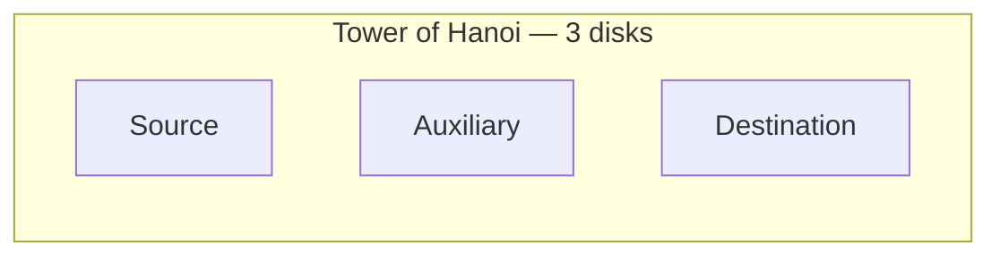

```java
public class TowerOfHanoi {
    public static void solve(int n, char source, char aux, char dest) {
        if (n == 1) {
            System.out.println("Move disk 1 from " + source + " to " + dest);
            return;
        }
        solve(n - 1, source, dest, aux);
        System.out.println("Move disk " + n + " from " + source + " to " + dest);
        solve(n - 1, aux, source, dest);
    }

    public static void main(String[] args) {
        solve(3, 'A', 'B', 'C');
    }
}
```

```python
def tower_of_hanoi(n, source, auxiliary, destination):
    if n == 1:
        print(f"Move disk 1 from {source} to {destination}")
        return
    tower_of_hanoi(n - 1, source, destination, auxiliary)
    print(f"Move disk {n} from {source} to {destination}")
    tower_of_hanoi(n - 1, auxiliary, source, destination)

tower_of_hanoi(3, 'A', 'B', 'C')
```

**Output for n=3:**
```
Move disk 1 from A to C
Move disk 2 from A to B
Move disk 1 from C to B
Move disk 3 from A to C
Move disk 1 from B to A
Move disk 2 from B to C
Move disk 1 from A to C
```

**Complexity:** O(2ⁿ) — 3 disks require 7 moves, n disks require 2ⁿ - 1 moves.

#### Tree Traversal

```java
class TreeNode {
    int val;
    TreeNode left, right;

    TreeNode(int val) { this.val = val; }
}

public class TreeTraversal {
    // In-order: left → root → right
    public void inOrder(TreeNode node) {
        if (node == null) return;
        inOrder(node.left);
        System.out.print(node.val + " ");
        inOrder(node.right);
    }

    // Pre-order: root → left → right
    public void preOrder(TreeNode node) {
        if (node == null) return;
        System.out.print(node.val + " ");
        preOrder(node.left);
        preOrder(node.right);
    }

    // Post-order: left → right → root
    public void postOrder(TreeNode node) {
        if (node == null) return;
        postOrder(node.left);
        postOrder(node.right);
        System.out.print(node.val + " ");
    }
}
```

### Common Mistakes

| Mistake | Problem | Solution |
|---------|---------|----------|
| Missing base case | Infinite recursion → stack overflow | Always define a terminating condition |
| Wrong base case | Incorrect results | Trace through the simplest input manually |
| No progress toward base case | Stack overflow | Ensure input shrinks each recursive call |
| Stack overflow with deep recursion | Crash on large input | Use iteration or tail-call optimization |
| Recomputation in recursion | O(2ⁿ) instead of O(n) | Use memoization |

> ⚠️ **Warning:** Each recursive call consumes stack memory. Default Java stack size is ~1MB. A recursive depth of ~10,000 will overflow. Python's recursion limit is 1000 by default.

### Best Practices

- ✅ Always identify the base case first
- ✅ Ensure every recursive call moves toward the base case
- ✅ Use memoization for overlapping subproblems
- ✅ Prefer iteration for problems with linear depth that Java can't tail-optimize
- ✅ Draw the recursion tree for complex recursive problems
- ✅ Test with n=0 and n=1 as edge cases

### Interview Questions

> ❓ **Interview Question:** "Implement a function to generate all permutations of a string."

```java
import java.util.ArrayList;
import java.util.List;

public class Permutations {
    public static List<String> permute(String str) {
        List<String> result = new ArrayList<>();
        backtrack("", str, result);
        return result;
    }

    private static void backtrack(String prefix, String remaining, List<String> result) {
        int n = remaining.length();
        if (n == 0) {
            result.add(prefix);  // base case — no more characters
        } else {
            for (int i = 0; i < n; i++) {
                // Choose one character, recurse on the rest
                backtrack(
                    prefix + remaining.charAt(i),
                    remaining.substring(0, i) + remaining.substring(i + 1, n),
                    result
                );
            }
        }
    }

    public static void main(String[] args) {
        System.out.println(permute("abc"));
        // [abc, acb, bac, bca, cab, cba]
    }
}
```

> ❓ **Interview Question:** "What does this recursive function do? What is its complexity?"

```java
public int mystery(int n) {
    if (n <= 1) return 0;
    return 1 + mystery(n / 2);
}
```

**Answer:** It computes `floor(log₂(n))`. Complexity: O(log n) time, O(log n) stack space.

### Practical Exercises

1. **Power function:** Calculate x^n recursively (O(log n) approach)
2. **GCD:** Find the greatest common divisor using Euclid's algorithm recursively
3. **Reverse string:** Reverse a string using recursion (no loops)
4. **Palindrome:** Check palindrome using recursion
5. **Subsets:** Generate all subsets of a set (power set)

### Mini Project: Recursive Directory Size Calculator

```python
import os

def get_directory_size(path):
    total = 0

    try:
        for entry in os.scandir(path):
            if entry.is_file(follow_symlinks=False):
                total += entry.stat().st_size
            elif entry.is_dir(follow_symlinks=False):
                total += get_directory_size(entry.path)  # recursive call
    except PermissionError:
        print(f"Permission denied: {path}")

    return total

def format_size(size):
    for unit in ['B', 'KB', 'MB', 'GB', 'TB']:
        if size < 1024:
            return f"{size:.2f} {unit}"
        size /= 1024
    return f"{size:.2f} PB"

path = input("Enter directory path: ")
total = get_directory_size(path)
print(f"Total size: {format_size(total)}")
```

### Revision Notes

- Every recursive function needs a **base case** and a **recursive case**
- The call stack grows with each recursive call — deep recursion may overflow
- **Linear recursion** = one call per frame; **binary recursion** = two calls per frame
- **Tail recursion** can be optimized into a loop (Python/Java generally don't do this)
- **Memoization** caches results to avoid recomputation
- Recursion is ideal for trees, graphs, divide-and-conquer, and backtracking
- Towers of Hanoi: O(2ⁿ) time, Fibonacci: O(2ⁿ) naive, O(n) memoized

---

## Chapter 4: Clean Code & Best Practices

### Introduction

Clean code is code that is **easy to read, understand, and modify**. It is not about making the computer happy — the computer doesn't care. It is about making **other humans** happy. You and your future self are the most important audience for your code.

### Why It Matters

> ✅ **Best Practice:** Write code as if the person maintaining it is a violent psychopath who knows where you live.

- **85% of software cost** is in maintenance, not initial development
- **Readability = productivity**: Clean code takes 50% less time to debug
- **Onboarding**: New team members can contribute faster with clean code
- **Bug reduction**: Clear code has fewer hidden bugs

### Real World Analogy: Writing a Recipe

A recipe written as:
> "take stuff, heat, done" — *unusable*

A recipe written as:
> "Preheat oven to 375°F (190°C). In a medium bowl, combine 2 cups of all-purpose flour with 1 tsp baking soda and 1/2 tsp salt..." — *clear, precise, repeatable*

Clean code is the second recipe. It leaves nothing to interpretation.

### Theory: The Principles of Clean Code

#### 1. Meaningful Names

Names should reveal intent. A name should answer: **why does this exist, what does it do, and how is it used?**

```java
// BAD — what is this?
int d;  // elapsed time in days

// GOOD — reveals intent
int elapsedTimeInDays;
int daysSinceModification;
int fileAgeInDays;
```

| Bad | Good | Why |
|-----|------|-----|
| `int a;` | `int itemCount;` | More descriptive |
| `List<Map<String,String>> data;` | `List<Invoice> invoices;` | Hides complexity behind abstractions |
| `public void process()` | `public void processPayment()` | Tells what the method does |
| `boolean flag;` | `boolean isActive;` | Boolean variables should read like predicates |
| `String n, s;` | `String firstName, lastName;` | Avoids ambiguity |

```java
// BAD
public List<int[]> getThem(List<int[]> theList) {
    List<int[]> list1 = new ArrayList<>();
    for (int[] x : theList) {
        if (x[0] == 4) list1.add(x);
    }
    return list1;
}

// GOOD
public List<int[]> getFlaggedCells(List<int[]> gameBoard) {
    List<int[]> flaggedCells = new ArrayList<>();
    for (int[] cell : gameBoard) {
        if (cell[STATUS_VALUE] == FLAGGED) flaggedCells.add(cell);
    }
    return flaggedCells;
}

// EVEN BETTER — use a proper abstraction
public List<Cell> getFlaggedCells(GameBoard board) {
    return board.getCells().stream()
        .filter(Cell::isFlagged)
        .collect(Collectors.toList());
}
```

#### 2. Small Functions

Functions should be **small** — ideally 4-6 lines, never more than 20-30 lines. A function should do **one thing** and do it well.

```java
// BAD — one giant function doing everything
public void processOrder(Order order) {
    // Validate order
    if (order == null || order.getItems().isEmpty()) {
        throw new IllegalArgumentException("Invalid order");
    }
    for (Item item : order.getItems()) {
        if (item.getQuantity() <= 0) {
            throw new IllegalArgumentException("Invalid quantity");
        }
    }

    // Calculate total
    double total = 0;
    for (Item item : order.getItems()) {
        total += item.getPrice() * item.getQuantity();
    }

    // Apply discount
    if (order.getCustomer().isPremium()) {
        total *= 0.9;
    }

    // Process payment
    Payment payment = new CreditCardProcessor().charge(
        order.getCustomer().getCreditCard(), total
    );

    // Send notification
    emailService.sendOrderConfirmation(order, payment);
}

// GOOD — decomposed into small, single-responsibility functions
public void processOrder(Order order) {
    validateOrder(order);
    double total = calculateTotal(order);
    Payment payment = chargeCustomer(order, total);
    notifyCustomer(order, payment);
}

private void validateOrder(Order order) {
    if (order == null || order.getItems().isEmpty()) {
        throw new IllegalArgumentException("Order must have items");
    }
    order.getItems().forEach(this::validateItem);
}

private void validateItem(Item item) {
    if (item.getQuantity() <= 0) {
        throw new IllegalArgumentException("Item quantity must be positive");
    }
}

private double calculateTotal(Order order) {
    double subtotal = order.getItems().stream()
        .mapToDouble(item -> item.getPrice() * item.getQuantity())
        .sum();
    return applyDiscount(order, subtotal);
}

private double applyDiscount(Order order, double total) {
    return order.getCustomer().isPremium() ? total * 0.9 : total;
}

private Payment chargeCustomer(Order order, double amount) {
    return creditCardProcessor.charge(
        order.getCustomer().getCreditCard(), amount
    );
}

private void notifyCustomer(Order order, Payment payment) {
    emailService.sendOrderConfirmation(order, payment);
}
```

#### 3. Comments

> ⚠️ **Warning:** A comment is a failure to express yourself in code. The best comment is the one you don't need to write.

**Good uses of comments:**
- Legal disclaimers
- Explanation of intent (why, not what)
- Warnings about consequences
- TODO notes (with ticket reference)

**Bad uses of comments:**
- Explaining what the code does (let the code speak)
- Commented-out code (delete it — version control remembers)
- Journaling / changelog comments

```java
// BAD — explaining what the code does (redundant)
// Increment the counter by 1
counter++;

// GOOD — explaining why the code does it (intent)
// Offset by 1 because the loop counter starts at 0
int displayIndex = actualIndex + 1;

// BAD — commented-out code
// public void oldMethod() {
//     System.out.println("This is old");
// }

// GOOD — warning about consequences
// WARNING: This method modifies the shared state. Must hold the mutex lock.
public void updateSharedResource() { ... }

// GOOD — TODO with context
// TODO(dhruv): Revisit this logic after the discount model refactor (TICKET-123)
```

#### 4. Formatting

Consistent formatting improves readability dramatically.

```java
// BAD — inconsistent and messy formatting
public class data{
public int x;
public String n;
    public data(int x,String n){
this.x=x;this.n=n;
}public void p(){System.out.println(x+","+n);}}

// GOOD — clean, consistent formatting
public class DataPoint {
    private int value;
    private String name;

    public DataPoint(int value, String name) {
        this.value = value;
        this.name = name;
    }

    public void print() {
        System.out.println(value + ", " + name);
    }
}
```

**Formatting rules:**
- Use an auto-formatter (Prettier for JS, `google-java-format` for Java, Black for Python)
- Consistent indentation (2 or 4 spaces — never tabs and spaces mixed)
- Vertical spacing: separate concepts with blank lines
- Related concepts should be vertically close
- Line length: max 80-120 characters

#### 5. Error Handling

Error handling is code, and it should be just as clean as business logic.

```java
// BAD — return codes and deeply nested error handling
public String processFile(String path) {
    if (path != null) {
        File file = new File(path);
        if (file.exists()) {
            try {
                String content = readFile(file);
                if (content != null) {
                    return transformContent(content);
                } else {
                    return "ERROR: Empty file";
                }
            } catch (IOException e) {
                return "ERROR: IO exception";
            }
        } else {
            return "ERROR: File not found";
        }
    }
    return "ERROR: Path is null";
}

// GOOD — separate error handling from business logic
public String processFile(String path) throws FileProcessingException {
    validatePath(path);
    String content = readFileContent(path);
    return transformContent(content);
}

private void validatePath(String path) {
    if (path == null) throw new FileProcessingException("Path must not be null");
    if (!new File(path).exists()) throw new FileProcessingException("File not found: " + path);
}

private String readFileContent(String path) {
    try {
        return Files.readString(Path.of(path));
    } catch (IOException e) {
        throw new FileProcessingException("Failed to read file", e);
    }
}
```

**Best practices for error handling:**
- Use exceptions, not return codes
- Provide context with exceptions (include failed input)
- Define exception classes per layer
- Don't return null — throw or return Optional
- Don't pass null — assert or throw

#### 6. DRY Principle

**D**on't **R**epeat **Y**ourself — every piece of knowledge must have a single, unambiguous representation.

```java
// BAD — duplicated logic
public double calculateAreaOfRectangle(double width, double height) {
    return width * height;
}

public double calculateAreaOfSquare(double side) {
    return side * side;
}

// GOOD — no duplication
public double calculateAreaOfRectangle(double width, double height) {
    return width * height;
}

public double calculateAreaOfSquare(double side) {
    return calculateAreaOfRectangle(side, side);
}
```

#### 7. Boy Scout Rule

> ✅ **Best Practice:** Leave the campground cleaner than you found it.

Always make a small improvement to the code you touch — rename a confusing variable, extract a method, add a test. Over time, this prevents code rot.

### Code Review Checklist

| Category | Check |
|----------|-------|
| **Correctness** | Does the code do what it's supposed to? |
| **Completeness** | Are edge cases handled? Are error conditions covered? |
| **Readability** | Are names clear? Are functions small? Is formatting consistent? |
| **Testability** | Is the code easy to unit test? Are there tests? |
| **Security** | Are inputs validated? Are there injection risks? |
| **Performance** | Is the complexity appropriate? Are there N+1 queries? |
| **Consistency** | Does it follow project conventions? |

### Common Mistakes

| Mistake | Why It's Harmful | Solution |
|---------|-----------------|----------|
| Writing a 200-line function | Impossible to understand or test | Extract smaller functions |
| Using single-letter variables | Meaningless to readers | Use descriptive names |
| Leaving commented-out code | Confusing — is it dead or meaningful? | Delete it — use version control |
| Ignoring error cases | Crashes in production | Always handle errors |
| Copy-pasting code | Duplication increases maintenance cost | Extract into a shared function |
| Inconsistent formatting | Harder to spot actual changes | Use an auto-formatter |

### Best Practices

- ✅ Names should reveal intent — avoid disinformation
- ✅ Functions should do one thing — if you need a comment, extract it
- ✅ The best comment is no comment — express yourself in code
- ✅ One level of abstraction per function
- ✅ Keep error handling separate from business logic
- ✅ Use exceptions, not return codes
- ✅ Follow the Boy Scout Rule with every commit

### Interview Questions

> ❓ **Interview Question:** "What makes code 'clean' in your opinion?"

**Expected answer:** Clean code is easy to read, understand, and modify. It has meaningful names, small focused functions, no duplication, proper error handling, and consistent formatting. It communicates intent clearly and is tested.

> ❓ **Interview Question:** "When is it acceptable to write a comment?"

**Expected answer:** When the code cannot express itself — legal notices, intent explanations, consequences of non-obvious decisions, and TODOs linked to tickets.

### Practical Exercises

1. Take a 100+ line function and decompose it into small functions
2. Rename variables in a legacy codebase using the "reveal intent" rule
3. Remove all commented-out code from a project
4. Set up a formatter (Prettier / Black / google-java-format) and format a project
5. Review a pull request using the code review checklist

### Mini Project: Refactor a Legacy Module

Take a poorly written module (from a sample project or open-source repo) and refactor it applying all clean code principles:

1. Extract functions
2. Rename variables
3. Add proper error handling
4. Remove duplication
5. Write unit tests

### Revision Notes

- **Names:** Reveal intent, avoid disinformation, make meaningful distinctions
- **Functions:** Small (4-6 lines), single-responsibility, one level of abstraction
- **Comments:** Only when code can't express intent; never redundant comments
- **Formatting:** Auto-format, consistent indentation, vertical separation
- **Errors:** Exceptions > return codes, provide context, don't return/pass null
- **DRY:** Every piece of knowledge in a single place
- **Boy Scout Rule:** Always leave code cleaner than you found it

---

## Chapter 5: SOLID Principles

### Introduction

SOLID is a set of five design principles for object-oriented programming introduced by Robert C. Martin (Uncle Bob). These principles help you create systems that are **maintainable, scalable, and resilient to change**.

### Why It Matters

> ✅ **Best Practice:** SOLID principles are not rules — they are guidelines. The goal is to manage dependencies so that change is localized and safe.

- **Change is inevitable** — SOLID makes it safe
- **Testability** — SOLID code is inherently testable
- **Team scalability** — Multiple developers can work on SOLID code without stepping on each other
- **Interview essential** — Every senior developer interview expects you to discuss these

### Real World Analogy: A Modular Kitchen

A well-organized kitchen has:
- **Single Responsibility:** Each appliance has one job (toaster toasts, fridge cools)
- **Open-Closed:** You can add a microwave without modifying the oven
- **Liskov Substitution:** Any brand of skillet works on any stove
- **Interface Segregation:** You don't need a blender that also washes dishes
- **Dependency Inversion:** The wall outlet doesn't care what appliance you plug in

### S — Single Responsibility Principle (SRP)

> **A class should have only one reason to change.**

**Theory:** A class should have only one job or responsibility. If a class has multiple responsibilities, changes to one responsibility may break the others.

```java
// BAD — Invoice class has multiple responsibilities
public class Invoice {
    private double amount;
    private String customerEmail;

    public void calculateTotal() { /* ... */ }

    // Responsibility 2: Persistence — saving to database
    public void saveToDatabase() {
        // Database code here
    }

    // Responsibility 3: Communication — sending email
    public void sendEmailInvoice() {
        // Email code here
    }

    // Responsibility 4: Formatting — printing
    public void printInvoice() {
        // Print code here
    }
}
// FOUR reasons to change: calculation logic, DB schema, email template, print format
```

```java
// GOOD — Each class has one responsibility
public class Invoice {
    private double amount;
    private String customerEmail;

    public void calculateTotal() { /* ... */ }
}

public class InvoiceRepository {
    public void save(Invoice invoice) { /* Database code */ }
}

public class EmailService {
    public void sendInvoice(String email, Invoice invoice) { /* Email code */ }
}

public class InvoicePrinter {
    public void print(Invoice invoice) { /* Print code */ }
}
```

### O — Open-Closed Principle (OCP)

> **Software entities should be open for extension but closed for modification.**

**Theory:** You should be able to add new functionality without changing existing code. Achieved through abstraction and polymorphism.

```java
// BAD — Adding a new shape requires modifying the AreaCalculator
public class AreaCalculator {
    public double calculateArea(Object shape) {
        if (shape instanceof Circle) {
            Circle c = (Circle) shape;
            return Math.PI * c.getRadius() * c.getRadius();
        } else if (shape instanceof Rectangle) {
            Rectangle r = (Rectangle) shape;
            return r.getWidth() * r.getHeight();
        }
        // Adding Triangle requires modifying this class!
        throw new UnsupportedOperationException("Unknown shape");
    }
}

// GOOD — Open for extension, closed for modification
public interface Shape {
    double calculateArea();
}

public class Circle implements Shape {
    private double radius;

    public Circle(double radius) { this.radius = radius; }

    @Override
    public double calculateArea() {
        return Math.PI * radius * radius;
    }
}

public class Rectangle implements Shape {
    private double width, height;

    public Rectangle(double width, double height) {
        this.width = width;
        this.height = height;
    }

    @Override
    public double calculateArea() {
        return width * height;
    }
}

// Add Triangle without modifying anything
public class Triangle implements Shape {
    private double base, height;

    public Triangle(double base, double height) {
        this.base = base;
        this.height = height;
    }

    @Override
    public double calculateArea() {
        return 0.5 * base * height;
    }
}

public class AreaCalculator {
    public double calculateArea(Shape shape) {
        return shape.calculateArea();  // No modification needed — ever
    }
}
```

### L — Liskov Substitution Principle (LSP)

> **Objects of a superclass should be replaceable with objects of a subclass without affecting the correctness of the program.**

**Theory:** If you have a function that takes a base class, you should be able to pass any derived class without unexpected behavior.

```java
// BAD — Square violates LSP because it changes the contract
public class Rectangle {
    protected int width;
    protected int height;

    public void setWidth(int width) { this.width = width; }
    public void setHeight(int height) { this.height = height; }
    public int getArea() { return width * height; }
}

public class Square extends Rectangle {
    @Override
    public void setWidth(int width) {
        this.width = width;
        this.height = width;  // Side effect! Changes height too
    }

    @Override
    public void setHeight(int height) {
        this.width = height;  // Side effect! Changes width too
        this.height = height;
    }
}

// This code breaks with Square:
public void resize(Rectangle rect) {
    rect.setWidth(5);
    rect.setHeight(10);
    // Expects area = 50, but with Square, area = 100!
    assert rect.getArea() == 50 : "Area should be 50";
}
```

```java
// GOOD — Use a common abstraction that doesn't violate LSP
public interface Shape {
    int getArea();
}

public class Rectangle implements Shape {
    private int width, height;

    public Rectangle(int width, int height) {
        this.width = width;
        this.height = height;
    }

    @Override
    public int getArea() { return width * height; }
}

public class Square implements Shape {
    private int side;

    public Square(int side) { this.side = side; }

    @Override
    public int getArea() { return side * side; }
}
// No setter-based contract to violate
```

### I — Interface Segregation Principle (ISP)

> **Clients should not be forced to depend on interfaces they do not use.**

**Theory:** Large, "fat" interfaces should be split into smaller, more specific ones so that implementing classes only need to implement the methods relevant to them.

```java
// BAD — Fat interface forces unnecessary implementations
public interface Worker {
    void work();
    void eat();
    void sleep();
}

public class HumanWorker implements Worker {
    @Override
    public void work() { System.out.println("Working"); }

    @Override
    public void eat() { System.out.println("Eating"); }

    @Override
    public void sleep() { System.out.println("Sleeping"); }
}

public class RobotWorker implements Worker {
    @Override
    public void work() { System.out.println("Working"); }

    @Override
    public void eat() {
        // Robots don't eat! Forced to implement an empty method
    }

    @Override
    public void sleep() {
        // Robots don't sleep! Forced to implement an empty method
    }
}
```

```java
// GOOD — Segregated interfaces
public interface Workable {
    void work();
}

public interface Eatable {
    void eat();
}

public interface Sleepable {
    void sleep();
}

public class HumanWorker implements Workable, Eatable, Sleepable {
    @Override
    public void work() { System.out.println("Working"); }

    @Override
    public void eat() { System.out.println("Eating"); }

    @Override
    public void sleep() { System.out.println("Sleeping"); }
}

public class RobotWorker implements Workable {
    @Override
    public void work() { System.out.println("Working"); }
    // No need to implement eat() or sleep() — they don't exist here
}
```

### D — Dependency Inversion Principle (DIP)

> **High-level modules should not depend on low-level modules. Both should depend on abstractions. Abstractions should not depend on details. Details should depend on abstractions.**

**Theory:** This is NOT about dependency injection (though DI is a common implementation). It's about decoupling by depending on interfaces, not concrete classes.

```java
// BAD — High-level class depends directly on low-level class
public class EmailNotifier {
    private SmtpServer smtpServer;

    public EmailNotifier() {
        this.smtpServer = new SmtpServer("smtp.gmail.com", 587);
        // Direct dependency — can't easily test or swap
    }

    public void send(String message) {
        smtpServer.send(message);
    }
}

public class NotificationService {
    private EmailNotifier notifier;

    public NotificationService() {
        this.notifier = new EmailNotifier();  // Tight coupling
    }

    public void notifyUser(String message) {
        notifier.send(message);
    }
}
```

```java
// GOOD — Both depend on abstraction
public interface MessageSender {
    void send(String message);
}

public class EmailSender implements MessageSender {
    private SmtpServer smtpServer;

    public EmailSender(String host, int port) {
        this.smtpServer = new SmtpServer(host, port);
    }

    @Override
    public void send(String message) {
        smtpServer.send(message);
    }
}

public class SmsSender implements MessageSender {
    @Override
    public void send(String message) {
        // Send SMS logic
    }
}

public class NotificationService {
    private final MessageSender sender;  // Depends on abstraction

    // Dependency injected — can be EmailSender, SmsSender, or anything
    public NotificationService(MessageSender sender) {
        this.sender = sender;
    }

    public void notifyUser(String message) {
        sender.send(message);
    }
}

// Usage — simple to swap implementations
MessageSender emailSender = new EmailSender("smtp.gmail.com", 587);
NotificationService emailNotification = new NotificationService(emailSender);

MessageSender smsSender = new SmsSender();
NotificationService smsNotification = new NotificationService(smsSender);
```

### Summary Diagram

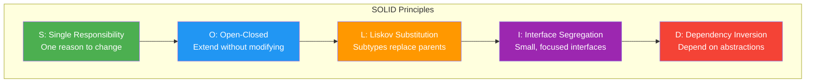

### Common Mistakes

| Mistake | Problem | Solution |
|---------|---------|----------|
| Over-engineering with SOLID | Too many tiny classes for a simple app | Apply principles where change is expected |
| Confusing SRP with "do one thing" | SRP is about *reasons to change*, not number of methods | A class can have many methods if they serve one responsibility |
| Violating LSP with inheritance | Subtle bugs when substituting subtypes | Prefer composition over inheritance |
| Creating too many interfaces (ISP) | Interface explosion | Find the right granularity for your use case |
| Thinking DIP = DI | DIP is about abstraction ownership, DI injects dependencies | You can have DI without DIP |

### Best Practices

- ✅ Apply SOLID where you anticipate change — don't over-apply it in simple CRUD apps
- ✅ Prefer composition over inheritance (it helps with LSP and OCP)
- ✅ Use dependency injection frameworks (Spring, Guice) to implement DIP
- ✅ Follow the "one level of abstraction" rule for SRP
- ✅ Test by substituting implementations (LSP + DIP make this easy)

### Interview Questions

> ❓ **Interview Question:** "Explain the Open-Closed Principle with a real-world example."

**Expected answer:** The OCP states that classes should be open for extension but closed for modification. For example, a payment processing system should allow adding new payment methods (credit card, PayPal, crypto) without modifying the existing payment processor class. This is achieved through a `PaymentMethod` interface that new methods implement.

> ❓ **Interview Question:** "What's the difference between Dependency Inversion and Dependency Injection?"

**Expected answer:** Dependency Inversion is a design principle that says high-level modules should not depend on low-level modules — both should depend on abstractions. Dependency Injection is a technique that implements this principle by providing (injecting) dependencies from outside rather than having the class create them.

> ❓ **Interview Question:** "Why does the Square-Rectangle problem violate LSP?"

### Practical Exercises

1. Identify SRP violations in your existing codebase and refactor
2. Implement a plugin system that follows OCP
3. Refactor a class hierarchy to fix LSP violations
4. Split a fat interface using ISP
5. Convert a tightly coupled class to use DIP with dependency injection

### Mini Project: Payment Processing System

Design a payment processing system that follows all five SOLID principles:

- **SRP:** Separate classes for validation, processing, notification, and logging
- **OCP:** Easy to add new payment methods (CreditCard, PayPal, Crypto, UPI)
- **LSP:** All payment methods must be interchangeable
- **ISP:** Separate interfaces for `Refundable`, `Chargeable`, `Verifiable`
- **DIP:** PaymentService depends on `PaymentGateway` interface, not concrete classes

### Revision Notes

- **SRP:** One class, one reason to change
- **OCP:** Extend behavior without modifying existing code (polymorphism)
- **LSP:** Subtypes must be substitutable for their base types
- **ISP:** Many small, focused interfaces are better than one large one
- **DIP:** Depend on abstractions, not concrete implementations
- SOLID leads to testable, maintainable, loosely-coupled systems
- Apply judiciously — avoid over-engineering simple systems

---

## Chapter 6: Design Patterns

### Introduction

Design patterns are **reusable solutions to commonly occurring problems** in software design. They are not code snippets you copy — they are templates for how to solve problems. First described in the "Gang of Four" (GoF) book in 1994, they remain relevant decades later.

### Why It Matters

- **Shared vocabulary** — "Let's use an Observer pattern" communicates a complex design instantly
- **Proven solutions** — These patterns solve real problems that have been encountered millions of times
- **Standardization** — Frameworks like Spring, Hibernate, and Angular are built on design patterns
- **Interview filter** — Senior roles expect you to know when and why to use each pattern

### Real World Analogy: Architectural Blueprints

A design pattern is like a blueprint for solving a common architectural problem. A "bridge" pattern is akin to knowing that a suspension bridge is right for a long span. You don't redesign the suspension bridge each time — you apply the proven pattern.

### Classification of Patterns

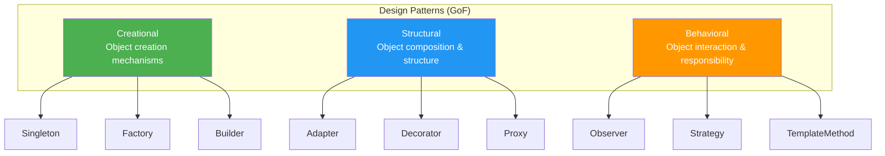

---

### Creational Patterns

Creational patterns deal with object creation mechanisms, trying to create objects in a manner suitable to the situation.

---

#### 1. Singleton Pattern

**Intent:** Ensure a class has only one instance and provide a global point of access to it.

**When to use:** Exactly one instance needed — logging, configuration, thread pools, database connection pools.

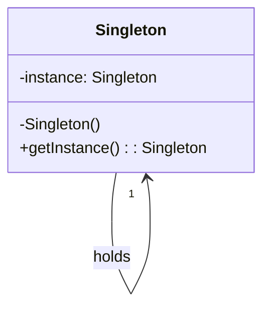

```java
// Thread-safe Singleton with lazy initialization
public class ConfigManager {
    private static volatile ConfigManager instance;
    private Properties config;

    private ConfigManager() {
        // Private constructor prevents external instantiation
        config = new Properties();
        loadConfig();
    }

    public static ConfigManager getInstance() {
        if (instance == null) {
            synchronized (ConfigManager.class) {
                if (instance == null) {
                    instance = new ConfigManager();
                }
            }
        }
        return instance;
    }

    public String get(String key) {
        return config.getProperty(key);
    }

    private void loadConfig() {
        // Load configuration from file
    }
}

// Usage
ConfigManager config = ConfigManager.getInstance();
String dbUrl = config.get("database.url");
```

```java
// Eager initialization — simpler, thread-safe
public class EagerSingleton {
    private static final EagerSingleton INSTANCE = new EagerSingleton();

    private EagerSingleton() {}

    public static EagerSingleton getInstance() {
        return INSTANCE;
    }
}
```

```java
// Enum singleton — most robust approach (prevents reflection attacks)
public enum DatabaseConnectionPool {
    INSTANCE;

    private final int maxConnections = 10;
    private int activeConnections = 0;

    public Connection getConnection() {
        if (activeConnections < maxConnections) {
            activeConnections++;
            return new Connection();
        }
        throw new RuntimeException("Max connections reached");
    }

    public void releaseConnection(Connection conn) {
        activeConnections--;
    }
}

// Usage
DatabaseConnectionPool pool = DatabaseConnectionPool.INSTANCE;
Connection conn = pool.getConnection();
```

```python
# Python Singleton using metaclass
class SingletonMeta(type):
    _instances = {}

    def __call__(cls, *args, **kwargs):
        if cls not in cls._instances:
            cls._instances[cls] = super().__call__(*args, **kwargs)
        return cls._instances[cls]

class ConfigManager(metaclass=SingletonMeta):
    def __init__(self):
        self.config = {}
        self._load_config()

    def _load_config(self):
        self.config["database.url"] = "jdbc:mysql://localhost:3306/mydb"

    def get(self, key):
        return self.config.get(key)

# Usage
config = ConfigManager()
db_url = config.get("database.url")
```

> ⚠️ **Warning:** Singletons can make unit testing difficult because they introduce global state. Prefer dependency injection when possible.

---

#### 2. Factory Pattern

**Intent:** Define an interface for creating an object, but let subclasses decide which class to instantiate.

**When to use:** When a class cannot anticipate the type of objects it needs to create.

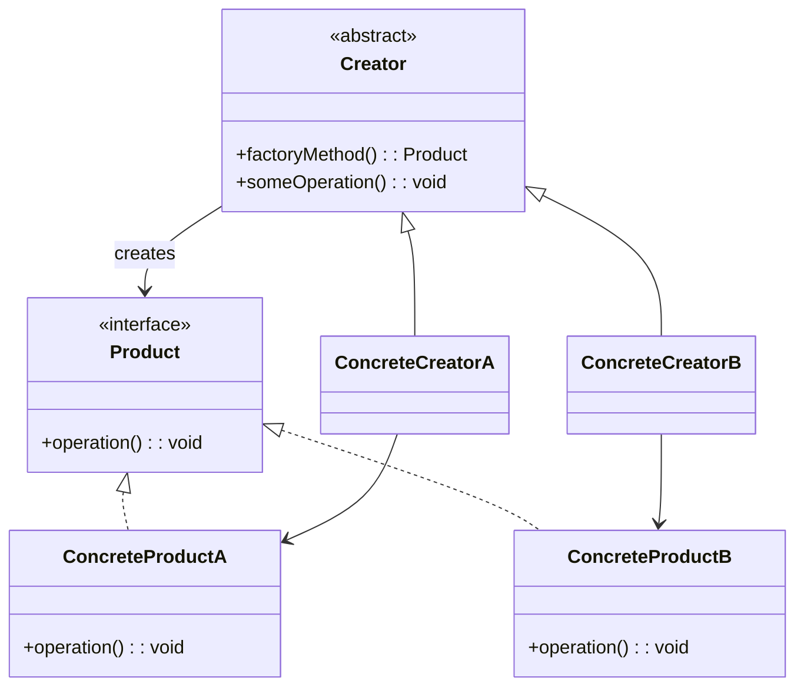

```java
// Product interface
public interface Notification {
    void send(String message);
}

// Concrete products
public class EmailNotification implements Notification {
    @Override
    public void send(String message) {
        System.out.println("Sending Email: " + message);
    }
}

public class SmsNotification implements Notification {
    @Override
    public void send(String message) {
        System.out.println("Sending SMS: " + message);
    }
}

public class PushNotification implements Notification {
    @Override
    public void send(String message) {
        System.out.println("Sending Push: " + message);
    }
}

// Factory
public class NotificationFactory {
    public static Notification createNotification(String channel) {
        return switch (channel.toLowerCase()) {
            case "email" -> new EmailNotification();
            case "sms" -> new SmsNotification();
            case "push" -> new PushNotification();
            default -> throw new IllegalArgumentException("Unknown channel: " + channel);
        };
    }
}

// Usage
public class NotificationService {
    public void notify(String channel, String message) {
        Notification notification = NotificationFactory.createNotification(channel);
        notification.send(message);
    }
}
```

```python
from abc import ABC, abstractmethod

class Notification(ABC):
    @abstractmethod
    def send(self, message: str) -> None:
        pass

class EmailNotification(Notification):
    def send(self, message: str) -> None:
        print(f"Sending Email: {message}")

class SmsNotification(Notification):
    def send(self, message: str) -> None:
        print(f"Sending SMS: {message}")

class PushNotification(Notification):
    def send(self, message: str) -> None:
        print(f"Sending Push: {message}")

class NotificationFactory:
    @staticmethod
    def create_notification(channel: str) -> Notification:
        factories = {
            "email": EmailNotification,
            "sms": SmsNotification,
            "push": PushNotification,
        }
        notification_class = factories.get(channel.lower())
        if not notification_class:
            raise ValueError(f"Unknown channel: {channel}")
        return notification_class()

# Usage
NotificationFactory.create_notification("email").send("Hello!")
```

---

#### 3. Builder Pattern

**Intent:** Separate the construction of a complex object from its representation so that the same construction process can create different representations.

**When to use:** Objects with many optional parameters, or when construction has multiple steps.

```java
// Product
public class Pizza {
    private String size;
    private boolean cheese;
    private boolean pepperoni;
    private boolean mushrooms;
    private boolean olives;
    private boolean extraSauce;

    // Private constructor — only Builder can create
    private Pizza(PizzaBuilder builder) {
        this.size = builder.size;
        this.cheese = builder.cheese;
        this.pepperoni = builder.pepperoni;
        this.mushrooms = builder.mushrooms;
        this.olives = builder.olives;
        this.extraSauce = builder.extraSauce;
    }

    public static class PizzaBuilder {
        // Required parameters
        private final String size;

        // Optional parameters with defaults
        private boolean cheese = false;
        private boolean pepperoni = false;
        private boolean mushrooms = false;
        private boolean olives = false;
        private boolean extraSauce = false;

        public PizzaBuilder(String size) {
            this.size = size;
        }

        public PizzaBuilder addCheese() { this.cheese = true; return this; }
        public PizzaBuilder addPepperoni() { this.pepperoni = true; return this; }
        public PizzaBuilder addMushrooms() { this.mushrooms = true; return this; }
        public PizzaBuilder addOlives() { this.olives = true; return this; }
        public PizzaBuilder addExtraSauce() { this.extraSauce = true; return this; }

        public Pizza build() {
            return new Pizza(this);
        }
    }

    @Override
    public String toString() {
        return "Pizza [size=" + size + ", cheese=" + cheese +
            ", pepperoni=" + pepperoni + ", mushrooms=" + mushrooms +
            ", olives=" + olives + ", extraSauce=" + extraSauce + "]";
    }
}

// Usage
Pizza pizza = new Pizza.PizzaBuilder("Large")
    .addCheese()
    .addPepperoni()
    .addMushrooms()
    .build();

System.out.println(pizza);
// Pizza [size=Large, cheese=true, pepperoni=true, mushrooms=true, olives=false, extraSauce=false]
```

```python
class Pizza:
    def __init__(self, builder):
        self.size = builder.size
        self.cheese = builder.cheese
        self.pepperoni = builder.pepperoni
        self.mushrooms = builder.mushrooms
        self.olives = builder.olives
        self.extra_sauce = builder.extra_sauce

    def __str__(self):
        return (f"Pizza [size={self.size}, cheese={self.cheese}, "
                f"pepperoni={self.pepperoni}, mushrooms={self.mushrooms}, "
                f"olives={self.olives}, extra_sauce={self.extra_sauce}]")

    class PizzaBuilder:
        def __init__(self, size):
            self.size = size
            self.cheese = False
            self.pepperoni = False
            self.mushrooms = False
            self.olives = False
            self.extra_sauce = False

        def add_cheese(self):
            self.cheese = True
            return self

        def add_pepperoni(self):
            self.pepperoni = True
            return self

        def add_mushrooms(self):
            self.mushrooms = True
            return self

        def add_olives(self):
            self.olives = True
            return self

        def add_extra_sauce(self):
            self.extra_sauce = True
            return self

        def build(self):
            return Pizza(self)

# Usage
pizza = Pizza.PizzaBuilder("Large")\
    .add_cheese()\
    .add_pepperoni()\
    .add_mushrooms()\
    .build()

print(pizza)
```

---

### Structural Patterns

Structural patterns deal with object composition, creating relationships between entities to form larger structures.

---

#### 4. Adapter Pattern

**Intent:** Convert the interface of a class into another interface that clients expect. Adapter lets classes work together that couldn't otherwise because of incompatible interfaces.

**When to use:** Integrating legacy code or third-party libraries with incompatible interfaces.

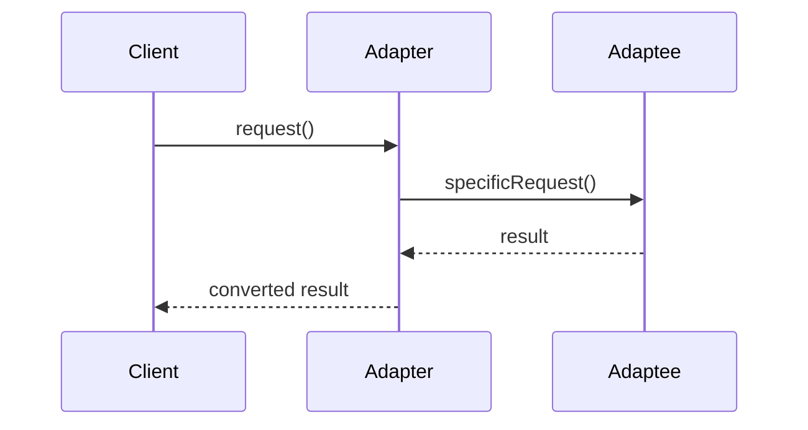

```java
// Target interface — what the client expects
public interface MediaPlayer {
    void play(String audioType, String fileName);
}

// Adaptee — existing class with incompatible interface
public class AdvancedMediaPlayer {
    public void playVlc(String fileName) {
        System.out.println("Playing VLC file: " + fileName);
    }

    public void playMp4(String fileName) {
        System.out.println("Playing MP4 file: " + fileName);
    }
}

// Adapter — bridges MediaPlayer and AdvancedMediaPlayer
public class MediaAdapter implements MediaPlayer {
    private AdvancedMediaPlayer advancedPlayer;

    public MediaAdapter() {
        this.advancedPlayer = new AdvancedMediaPlayer();
    }

    @Override
    public void play(String audioType, String fileName) {
        if (audioType.equalsIgnoreCase("vlc")) {
            advancedPlayer.playVlc(fileName);
        } else if (audioType.equalsIgnoreCase("mp4")) {
            advancedPlayer.playMp4(fileName);
        } else {
            System.out.println("Unsupported format: " + audioType);
        }
    }
}

// Client
public class AudioPlayer implements MediaPlayer {
    private MediaAdapter adapter;

    @Override
    public void play(String audioType, String fileName) {
        // Built-in support for MP3
        if (audioType.equalsIgnoreCase("mp3")) {
            System.out.println("Playing MP3 file: " + fileName);
        }
        // Adapter needed for other formats
        else if (audioType.equalsIgnoreCase("vlc") || audioType.equalsIgnoreCase("mp4")) {
            adapter = new MediaAdapter();
            adapter.play(audioType, fileName);
        } else {
            System.out.println("Invalid format: " + audioType);
        }
    }
}

// Usage
AudioPlayer player = new AudioPlayer();
player.play("mp3", "song.mp3");
player.play("mp4", "video.mp4");
player.play("vlc", "movie.vlc");
```

```python
# Target interface
class MediaPlayer:
    def play(self, audio_type: str, file_name: str) -> None:
        pass

# Adaptee
class AdvancedMediaPlayer:
    def play_vlc(self, file_name: str) -> None:
        print(f"Playing VLC file: {file_name}")

    def play_mp4(self, file_name: str) -> None:
        print(f"Playing MP4 file: {file_name}")

# Adapter
class MediaAdapter(MediaPlayer):
    def __init__(self):
        self.advanced_player = AdvancedMediaPlayer()

    def play(self, audio_type: str, file_name: str) -> None:
        if audio_type.lower() == "vlc":
            self.advanced_player.play_vlc(file_name)
        elif audio_type.lower() == "mp4":
            self.advanced_player.play_mp4(file_name)
        else:
            print(f"Unsupported format: {audio_type}")

# Client
class AudioPlayer(MediaPlayer):
    def __init__(self):
        self.adapter = None

    def play(self, audio_type: str, file_name: str) -> None:
        if audio_type.lower() == "mp3":
            print(f"Playing MP3 file: {file_name}")
        elif audio_type.lower() in ("vlc", "mp4"):
            self.adapter = MediaAdapter()
            self.adapter.play(audio_type, file_name)
        else:
            print(f"Invalid format: {audio_type}")

# Usage
player = AudioPlayer()
player.play("mp3", "song.mp3")
player.play("mp4", "video.mp4")
```

---

#### 5. Decorator Pattern

**Intent:** Attach additional responsibilities to an object dynamically. Decorators provide a flexible alternative to subclassing for extending functionality.

**When to use:** When you need to add features to objects without affecting other objects of the same class.

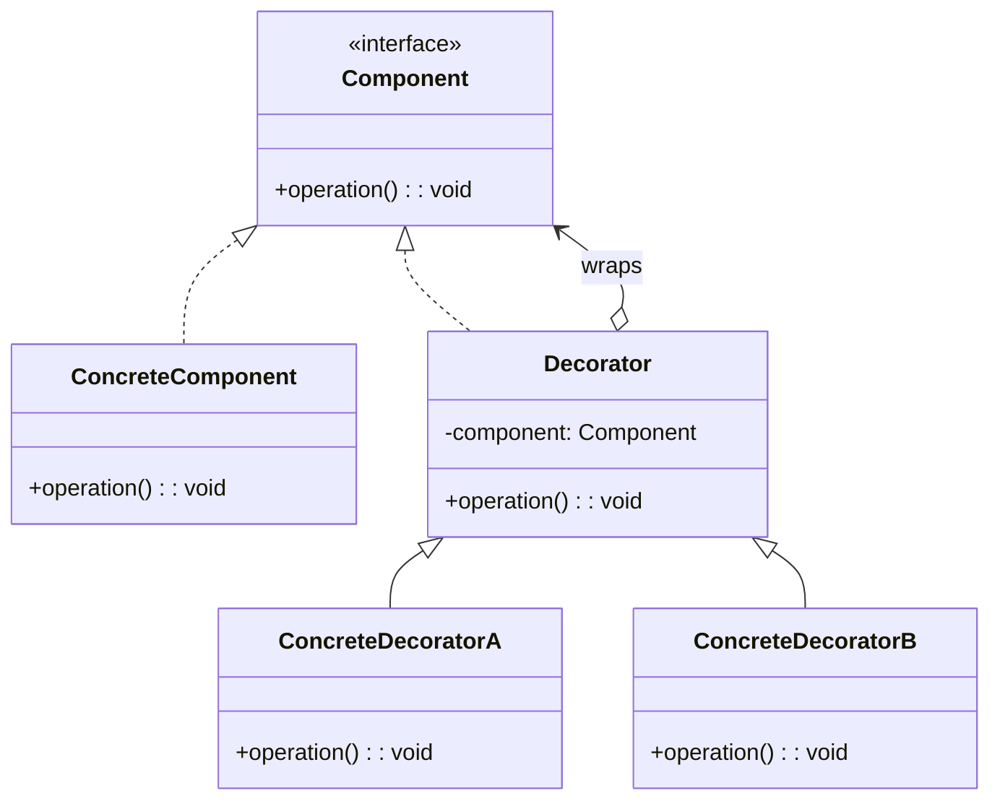

```java
// Component interface
public interface Coffee {
    String getDescription();
    double getCost();
}

// Concrete component
public class SimpleCoffee implements Coffee {
    @Override
    public String getDescription() {
        return "Simple coffee";
    }

    @Override
    public double getCost() {
        return 2.0;
    }
}

// Decorator base class
public abstract class CoffeeDecorator implements Coffee {
    protected Coffee decoratedCoffee;

    public CoffeeDecorator(Coffee coffee) {
        this.decoratedCoffee = coffee;
    }

    @Override
    public String getDescription() {
        return decoratedCoffee.getDescription();
    }

    @Override
    public double getCost() {
        return decoratedCoffee.getCost();
    }
}

// Concrete decorators
public class MilkDecorator extends CoffeeDecorator {
    public MilkDecorator(Coffee coffee) {
        super(coffee);
    }

    @Override
    public String getDescription() {
        return decoratedCoffee.getDescription() + " + Milk";
    }

    @Override
    public double getCost() {
        return decoratedCoffee.getCost() + 0.5;
    }
}

public class SugarDecorator extends CoffeeDecorator {
    public SugarDecorator(Coffee coffee) {
        super(coffee);
    }

    @Override
    public String getDescription() {
        return decoratedCoffee.getDescription() + " + Sugar";
    }

    @Override
    public double getCost() {
        return decoratedCoffee.getCost() + 0.2;
    }
}

public class WhippedCreamDecorator extends CoffeeDecorator {
    public WhippedCreamDecorator(Coffee coffee) {
        super(coffee);
    }

    @Override
    public String getDescription() {
        return decoratedCoffee.getDescription() + " + Whipped Cream";
    }

    @Override
    public double getCost() {
        return decoratedCoffee.getCost() + 0.7;
    }
}

// Usage
public class CoffeeShop {
    public static void main(String[] args) {
        Coffee coffee = new SimpleCoffee();
        System.out.println(coffee.getDescription() + " → $" + coffee.getCost());
        // Simple coffee → $2.0

        coffee = new MilkDecorator(coffee);
        coffee = new SugarDecorator(coffee);
        System.out.println(coffee.getDescription() + " → $" + coffee.getCost());
        // Simple coffee + Milk + Sugar → $2.7

        Coffee fancyCoffee = new WhippedCreamDecorator(
            new MilkDecorator(
                new SugarDecorator(
                    new SimpleCoffee()
                )
            )
        );
        System.out.println(fancyCoffee.getDescription() + " → $" + fancyCoffee.getCost());
        // Simple coffee + Sugar + Milk + Whipped Cream → $3.4
    }
}
```

```python
from abc import ABC, abstractmethod

class Coffee(ABC):
    @abstractmethod
    def get_description(self) -> str:
        pass

    @abstractmethod
    def get_cost(self) -> float:
        pass

class SimpleCoffee(Coffee):
    def get_description(self) -> str:
        return "Simple coffee"

    def get_cost(self) -> float:
        return 2.0

class CoffeeDecorator(Coffee):
    def __init__(self, coffee: Coffee):
        self._coffee = coffee

    def get_description(self) -> str:
        return self._coffee.get_description()

    def get_cost(self) -> float:
        return self._coffee.get_cost()

class MilkDecorator(CoffeeDecorator):
    def get_description(self) -> str:
        return f"{self._coffee.get_description()} + Milk"

    def get_cost(self) -> float:
        return self._coffee.get_cost() + 0.5

class SugarDecorator(CoffeeDecorator):
    def get_description(self) -> str:
        return f"{self._coffee.get_description()} + Sugar"

    def get_cost(self) -> float:
        return self._coffee.get_cost() + 0.2

class WhippedCreamDecorator(CoffeeDecorator):
    def get_description(self) -> str:
        return f"{self._coffee.get_description()} + Whipped Cream"

    def get_cost(self) -> float:
        return self._coffee.get_cost() + 0.7

# Usage
coffee = SimpleCoffee()
print(f"{coffee.get_description()} → ${coffee.get_cost()}")
# Simple coffee → $2.0

coffee = MilkDecorator(SugarDecorator(coffee))
print(f"{coffee.get_description()} → ${coffee.get_cost()}")
# Simple coffee + Sugar + Milk → $2.7

fancy = WhippedCreamDecorator(MilkDecorator(SugarDecorator(SimpleCoffee())))
print(f"{fancy.get_description()} → ${fancy.get_cost()}")
# Simple coffee + Sugar + Milk + Whipped Cream → $3.4
```

---

#### 6. Proxy Pattern

**Intent:** Provide a surrogate or placeholder for another object to control access to it.

**When to use:** Lazy loading, access control, logging, caching, or when the real object is expensive to create.

```java
// Subject interface
public interface Image {
    void display();
}

// RealSubject — expensive to create (loads from disk)
public class RealImage implements Image {
    private String fileName;

    public RealImage(String fileName) {
        this.fileName = fileName;
        loadFromDisk();
    }

    private void loadFromDisk() {
        System.out.println("Loading " + fileName + " from disk...");
        // Simulate expensive operation
        try { Thread.sleep(2000); } catch (InterruptedException e) {}
    }

    @Override
    public void display() {
        System.out.println("Displaying " + fileName);
    }
}

// Proxy — controls access to RealImage
public class ImageProxy implements Image {
    private RealImage realImage;
    private String fileName;

    public ImageProxy(String fileName) {
        this.fileName = fileName;
    }

    @Override
    public void display() {
        // Lazy initialization — only load when needed
        if (realImage == null) {
            realImage = new RealImage(fileName);
        }
        realImage.display();
    }
}

// Usage
public class ImageViewer {
    public static void main(String[] args) {
        // Proxy created — no disk loading yet
        Image image1 = new ImageProxy("photo1.jpg");
        Image image2 = new ImageProxy("photo2.jpg");

        // Image loads ONLY when display() is called
        image1.display();  // Loading from disk + Displaying
        image1.display();  // Only Displaying (already loaded)

        image2.display();  // Loading from disk + Displaying
    }
}
```

```python
import time
from abc import ABC, abstractmethod

class Image(ABC):
    @abstractmethod
    def display(self) -> None:
        pass

class RealImage(Image):
    def __init__(self, file_name: str):
        self.file_name = file_name
        self._load_from_disk()

    def _load_from_disk(self) -> None:
        print(f"Loading {self.file_name} from disk...")
        time.sleep(2)  # simulate expensive operation

    def display(self) -> None:
        print(f"Displaying {self.file_name}")

class ImageProxy(Image):
    def __init__(self, file_name: str):
        self.file_name = file_name
        self._real_image = None

    def display(self) -> None:
        if self._real_image is None:
            self._real_image = RealImage(self.file_name)
        self._real_image.display()

# Usage
image1 = ImageProxy("photo1.jpg")
image2 = ImageProxy("photo2.jpg")

image1.display()  # loads from disk
image1.display()  # from cache
image2.display()  # loads from disk
```

---

### Behavioral Patterns

Behavioral patterns deal with communication between objects, how they interact and distribute responsibility.

---

#### 7. Observer Pattern

**Intent:** Define a one-to-many dependency between objects so that when one object changes state, all its dependents are notified and updated automatically.

**When to use:** Event handling systems, notification services, real-time data feeds.

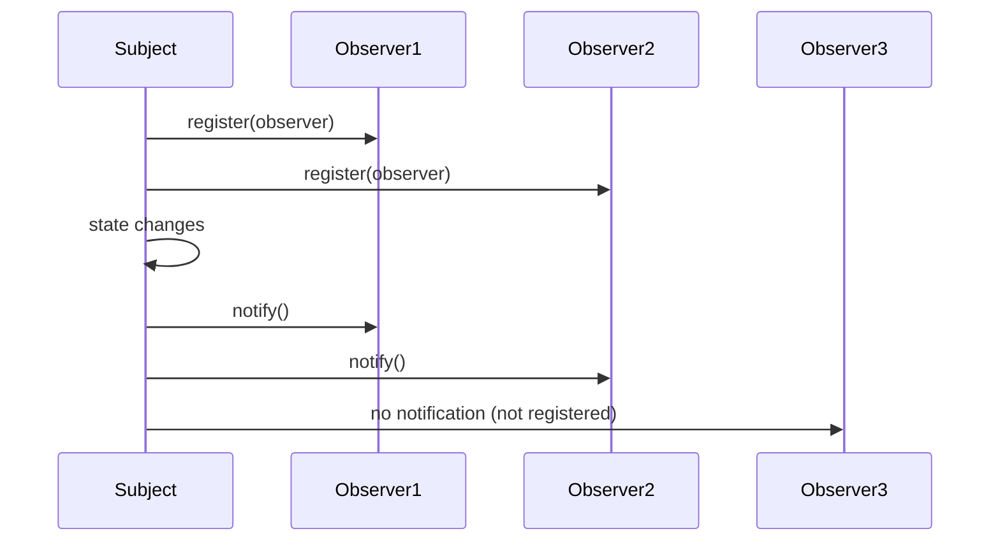

```java
import java.util.ArrayList;
import java.util.List;

// Observer interface
public interface Observer {
    void update(String stockSymbol, double price);
}

// Subject
public class StockMarket {
    private List<Observer> observers = new ArrayList<>();
    private String stockSymbol;
    private double price;

    public void register(Observer observer) {
        observers.add(observer);
    }

    public void unregister(Observer observer) {
        observers.remove(observer);
    }

    public void setStockPrice(String stockSymbol, double price) {
        this.stockSymbol = stockSymbol;
        this.price = price;
        notifyAllObservers();
    }

    private void notifyAllObservers() {
        for (Observer observer : observers) {
            observer.update(stockSymbol, price);
        }
    }
}

// Concrete observers
public class MobileApp implements Observer {
    private String appName;

    public MobileApp(String appName) {
        this.appName = appName;
    }

    @Override
    public void update(String stockSymbol, double price) {
        System.out.println(appName + " received alert: " + stockSymbol + " is now $" + price);
    }
}

public class EmailNotifier implements Observer {
    private String email;

    public EmailNotifier(String email) {
        this.email = email;
    }

    @Override
    public void update(String stockSymbol, double price) {
        System.out.println("Email to " + email + ": " + stockSymbol + " price changed to $" + price);
    }
}

// Usage
public class StockApp {
    public static void main(String[] args) {
        StockMarket market = new StockMarket();

        Observer mobileApp = new MobileApp("Robinhood");
        Observer emailNotifier = new EmailNotifier("user@example.com");

        market.register(mobileApp);
        market.register(emailNotifier);

        market.setStockPrice("AAPL", 150.25);
        // Both get notified

        market.unregister(emailNotifier);

        market.setStockPrice("GOOGL", 2750.00);
        // Only mobileApp gets notified
    }
}
```

```python
from abc import ABC, abstractmethod
from typing import List

class Observer(ABC):
    @abstractmethod
    def update(self, stock_symbol: str, price: float) -> None:
        pass

class StockMarket:
    def __init__(self):
        self._observers: List[Observer] = []
        self._stock_symbol = ""
        self._price = 0.0

    def register(self, observer: Observer) -> None:
        self._observers.append(observer)

    def unregister(self, observer: Observer) -> None:
        self._observers.remove(observer)

    def set_stock_price(self, stock_symbol: str, price: float) -> None:
        self._stock_symbol = stock_symbol
        self._price = price
        self._notify_all()

    def _notify_all(self) -> None:
        for observer in self._observers:
            observer.update(self._stock_symbol, self._price)

class MobileApp(Observer):
    def __init__(self, app_name: str):
        self.app_name = app_name

    def update(self, stock_symbol: str, price: float) -> None:
        print(f"{self.app_name} received alert: {stock_symbol} is now ${price}")

class EmailNotifier(Observer):
    def __init__(self, email: str):
        self.email = email

    def update(self, stock_symbol: str, price: float) -> None:
        print(f"Email to {self.email}: {stock_symbol} price changed to ${price}")

# Usage
market = StockMarket()
mobile = MobileApp("Robinhood")
email = EmailNotifier("user@example.com")

market.register(mobile)
market.register(email)

market.set_stock_price("AAPL", 150.25)
market.unregister(email)
market.set_stock_price("GOOGL", 2750.00)
```

---

#### 8. Strategy Pattern

**Intent:** Define a family of algorithms, encapsulate each one, and make them interchangeable. Strategy lets the algorithm vary independently from clients that use it.

**When to use:** Multiple ways to perform an operation (sorting, compression, payment, route calculation).

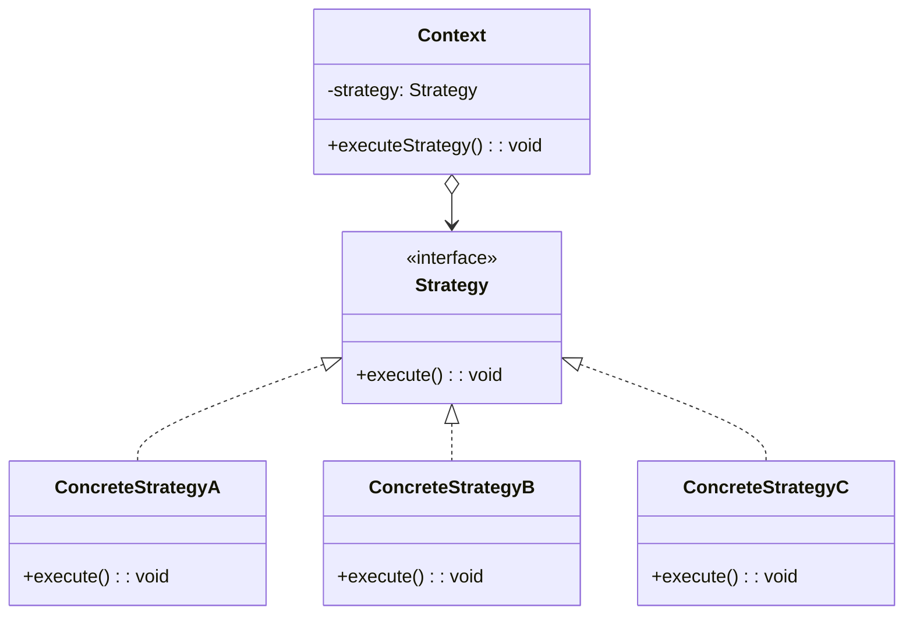

```java
// Strategy interface
public interface PaymentStrategy {
    void pay(double amount);
}

// Concrete strategies
public class CreditCardPayment implements PaymentStrategy {
    private String cardNumber;
    private String cvv;

    public CreditCardPayment(String cardNumber, String cvv) {
        this.cardNumber = cardNumber;
        this.cvv = cvv;
    }

    @Override
    public void pay(double amount) {
        System.out.println("Paid $" + amount + " via Credit Card ending in "
            + cardNumber.substring(cardNumber.length() - 4));
    }
}

public class PayPalPayment implements PaymentStrategy {
    private String email;

    public PayPalPayment(String email) {
        this.email = email;
    }

    @Override
    public void pay(double amount) {
        System.out.println("Paid $" + amount + " via PayPal (" + email + ")");
    }
}

public class CryptoPayment implements PaymentStrategy {
    private String walletAddress;

    public CryptoPayment(String walletAddress) {
        this.walletAddress = walletAddress;
    }

    @Override
    public void pay(double amount) {
        System.out.println("Paid $" + amount + " via Crypto to wallet " + walletAddress);
    }
}

// Context
public class ShoppingCart {
    private PaymentStrategy paymentStrategy;

    public void setPaymentStrategy(PaymentStrategy strategy) {
        this.paymentStrategy = strategy;
    }

    public void checkout(double total) {
        if (paymentStrategy == null) {
            throw new IllegalStateException("Payment strategy not set");
        }
        paymentStrategy.pay(total);
        // Additional checkout logic
    }
}

// Usage
public class CheckoutSystem {
    public static void main(String[] args) {
        ShoppingCart cart = new ShoppingCart();

        // Customer selects payment method at checkout
        cart.setPaymentStrategy(new CreditCardPayment("1234-5678-9012-3456", "123"));
        cart.checkout(99.99);

        // Or use different strategy
        cart.setPaymentStrategy(new PayPalPayment("user@example.com"));
        cart.checkout(49.99);

        // Strategies are interchangeable at runtime
        cart.setPaymentStrategy(new CryptoPayment("0xABC123..."));
        cart.checkout(250.00);
    }
}
```

```python
from abc import ABC, abstractmethod

class PaymentStrategy(ABC):
    @abstractmethod
    def pay(self, amount: float) -> None:
        pass

class CreditCardPayment(PaymentStrategy):
    def __init__(self, card_number: str, cvv: str):
        self.card_number = card_number
        self.cvv = cvv

    def pay(self, amount: float) -> None:
        print(f"Paid ${amount} via Credit Card ending in {self.card_number[-4:]}")

class PayPalPayment(PaymentStrategy):
    def __init__(self, email: str):
        self.email = email

    def pay(self, amount: float) -> None:
        print(f"Paid ${amount} via PayPal ({self.email})")

class CryptoPayment(PaymentStrategy):
    def __init__(self, wallet_address: str):
        self.wallet_address = wallet_address

    def pay(self, amount: float) -> None:
        print(f"Paid ${amount} via Crypto to wallet {self.wallet_address}")

class ShoppingCart:
    def __init__(self):
        self._payment_strategy = None

    def set_payment_strategy(self, strategy: PaymentStrategy) -> None:
        self._payment_strategy = strategy

    def checkout(self, total: float) -> None:
        if self._payment_strategy is None:
            raise ValueError("Payment strategy not set")
        self._payment_strategy.pay(total)

# Usage
cart = ShoppingCart()
cart.set_payment_strategy(CreditCardPayment("1234-5678-9012-3456", "123"))
cart.checkout(99.99)

cart.set_payment_strategy(PayPalPayment("user@example.com"))
cart.checkout(49.99)
```

---

#### 9. Template Method Pattern

**Intent:** Define the skeleton of an algorithm in an operation, deferring some steps to subclasses. Template Method lets subclasses redefine certain steps without changing the algorithm's structure.

**When to use:** When multiple classes share the same algorithm structure but differ in specific steps.

```java
// Abstract class with template method
public abstract class DataMiner {
    // Template method — defines the skeleton
    public final void mine(String filePath) {
        openFile(filePath);
        String rawData = extractData();
        String parsedData = parseData(rawData);
        analyzeData(parsedData);
        sendReport(parsedData);
        closeFile();
    }

    protected abstract void openFile(String path);
    protected abstract String extractData();
    protected abstract String parseData(String rawData);

    // Common step — same for all subclasses
    private void analyzeData(String data) {
        System.out.println("Analyzing data: " + data);
    }

    // Hook — optional step that subclasses can override
    protected void sendReport(String data) {
        // Default: no report — subclasses can override
    }

    // Common step
    private void closeFile() {
        System.out.println("Closing file");
    }
}

// Concrete classes
public class CsvDataMiner extends DataMiner {
    @Override
    protected void openFile(String path) {
        System.out.println("Opening CSV file: " + path);
    }

    @Override
    protected String extractData() {
        System.out.println("Extracting CSV data");
        return "csv,raw,data";
    }

    @Override
    protected String parseData(String rawData) {
        System.out.println("Parsing CSV data");
        return rawData.replace(",", " | ");
    }
}

public class PdfDataMiner extends DataMiner {
    @Override
    protected void openFile(String path) {
        System.out.println("Opening PDF file: " + path);
    }

    @Override
    protected String extractData() {
        System.out.println("Extracting PDF data with OCR");
        return "pdf extracted text";
    }

    @Override
    protected String parseData(String rawData) {
        System.out.println("Parsing PDF data");
        return rawData.toUpperCase();
    }

    @Override
    protected void sendReport(String data) {
        System.out.println("Sending PDF analysis report via email");
    }
}

// Usage
public class DataMiningApp {
    public static void main(String[] args) {
        DataMiner csvMiner = new CsvDataMiner();
        csvMiner.mine("data.csv");
        System.out.println("---");

        DataMiner pdfMiner = new PdfDataMiner();
        pdfMiner.mine("report.pdf");
    }
}
```

```python
from abc import ABC, abstractmethod

class DataMiner(ABC):
    # Template method
    def mine(self, file_path: str) -> None:
        self.open_file(file_path)
        raw_data = self.extract_data()
        parsed_data = self.parse_data(raw_data)
        self.analyze_data(parsed_data)
        self.send_report(parsed_data)
        self.close_file()

    @abstractmethod
    def open_file(self, path: str) -> None:
        pass

    @abstractmethod
    def extract_data(self) -> str:
        pass

    @abstractmethod
    def parse_data(self, raw_data: str) -> str:
        pass

    def analyze_data(self, data: str) -> None:
        print(f"Analyzing data: {data}")

    def send_report(self, data: str) -> None:
        pass  # Hook — optional

    def close_file(self) -> None:
        print("Closing file")

class CsvDataMiner(DataMiner):
    def open_file(self, path: str) -> None:
        print(f"Opening CSV file: {path}")

    def extract_data(self) -> str:
        print("Extracting CSV data")
        return "csv,raw,data"

    def parse_data(self, raw_data: str) -> str:
        print("Parsing CSV data")
        return raw_data.replace(",", " | ")

class PdfDataMiner(DataMiner):
    def open_file(self, path: str) -> None:
        print(f"Opening PDF file: {path}")

    def extract_data(self) -> str:
        print("Extracting PDF data with OCR")
        return "pdf extracted text"

    def parse_data(self, raw_data: str) -> str:
        print("Parsing PDF data")
        return raw_data.upper()

    def send_report(self, data: str) -> None:
        print("Sending PDF analysis report via email")

# Usage
CsvDataMiner().mine("data.csv")
print("---")
PdfDataMiner().mine("report.pdf")
```

### Design Patterns Comparison Table

| Pattern | Type | Intent | Real-World Example | Key Trade-off |
|---------|------|--------|-------------------|---------------|
| Singleton | Creational | One global instance | Logger, Config | Global state hurts testability |
| Factory | Creational | Create objects without specifying exact class | Notification system | Adds complexity for simple cases |
| Builder | Creational | Construct complex objects step-by-step | SQL query builder | More boilerplate code |
| Adapter | Structural | Make incompatible interfaces work together | Legacy system integration | Adds indirection layer |
| Decorator | Structural | Add responsibilities dynamically | Java I/O streams (`BufferedReader`) | Many small objects |
| Proxy | Structural | Control access to another object | Lazy loading, caching | May add latency |
| Observer | Behavioral | One-to-many notification | Event listeners, pub/sub | Memory leaks if not unregistered |
| Strategy | Behavioral | Interchangeable algorithms | Payment methods, sort strategies | Client must know available strategies |
| Template Method | Behavioral | Define algorithm skeleton, let subclasses fill steps | Data mining, build pipeline | Limited by inheritance |

### Common Mistakes

| Mistake | Problem | Solution |
|---------|---------|----------|
| Force-fitting patterns | Overly complex design for simple problems | Only use patterns when the problem matches |
| Singleton abuse | Hidden global state, testing nightmares | Use dependency injection instead |
| Strategy overuse | Proliferation of tiny classes for simple variants | Use simple conditionals for 2-3 variants |
| Observer memory leaks | Unregistered observers hold references to subjects | Always unregister, use weak references |
| Adapter misapplication | Wrapping things that don't need wrapping | Only adapt when interfaces are truly incompatible |

### Best Practices

- ✅ **Prefer composition over inheritance** — Decorator, Strategy, and Observer all use composition
- ✅ **Program to an interface, not an implementation** — Every pattern above relies on this
- ✅ **Don't start with patterns** — Start with a simple solution, refactor toward patterns when you see the need
- ✅ **Learn patterns by recognizing them in frameworks** — Spring uses Proxy, Factory, and Template Method; Java I/O uses Decorator
- ✅ **Use the right pattern for the right problem** — Study the intent, not just the implementation

### Interview Questions

> ❓ **Interview Question:** "What is the difference between the Strategy pattern and the State pattern?"

**Expected answer:** Strategy lets the client select an algorithm at runtime, and the algorithm is independent of the context. State changes the behavior of the context based on its internal state, and the state transitions are typically managed within the pattern. Strategy is about doing things differently; State is about being in different modes.

> ❓ **Interview Question:** "When would you use a Decorator over inheritance?"

**Expected answer:** Use Decorator when you need to add responsibilities to individual objects, not entire classes. Inheritance adds behavior at compile-time to all instances; Decorator adds it at runtime to specific instances. Decorator avoids class explosion — instead of having `MilkSugarCoffee`, `MilkWhippedCreamCoffee`, etc., you compose them.

> ❓ **Interview Question:** "How does the Proxy pattern differ from the Decorator pattern?"

**Expected answer:** Proxy controls access to the object (lazy loading, security, caching) and typically creates or manages the underlying object. Decorator adds behavior to the object and works with the object it wraps. Proxy usually has the same interface as the real object; Decorator often extends the interface.

### Practical Exercises

1. **Singleton:** Implement a thread-safe configuration manager
2. **Factory:** Build a document parser that creates different parser objects (PDF, DOCX, HTML)
3. **Builder:** Create an SQL query builder that constructs complex queries
4. **Adapter:** Wrap a legacy logging library to work with a modern logging interface
5. **Decorator:** Add compression and encryption to a file writer using decorators
6. **Observer:** Implement a chat room where users receive messages
7. **Strategy:** Build a sorting application that lets users switch between sorting algorithms
8. **Template Method:** Create a game loop template where different games implement specific steps

### Mini Project: E-Commerce Checkout System

Design a complete e-commerce checkout system using multiple design patterns:

- **Factory** — Create different `PaymentStrategy` objects based on user selection
- **Strategy** — Interchangeable payment processing (CreditCard, PayPal, Crypto)
- **Observer** — Notify inventory system, email service, and analytics on successful purchase
- **Decorator** — Add optional features (gift wrapping, insurance, express shipping)
- **Builder** — Construct complex `Order` objects with optional items and customizations
- **Singleton** — Centralized logging and configuration

### Revision Notes

- **Creational:** Singleton (one instance), Factory (creation delegation), Builder (step-by-step construction)
- **Structural:** Adapter (interface bridge), Decorator (dynamic extension), Proxy (access control)
- **Behavioral:** Observer (one-to-many notification), Strategy (interchangeable algorithms), Template Method (algorithm skeleton)
- Choose patterns based on **intent**, not implementation
- Patterns are guidelines, not rules — refactor toward them when the problem fits
- GoF patterns appear throughout modern frameworks — learn to recognize them

---

## Part 2 Summary

Throughout Part 2, you have built the foundational skills of a professional software engineer:

| Chapter | Core Skill | Real-World Application |
|---------|-----------|----------------------|
| 1 | Problem-Solving Framework | Breaking down any feature request into implementable steps |
| 2 | Complexity Analysis | Choosing the right data structures for performance-critical code |
| 3 | Recursion | Tree/Graph algorithms, functional programming |
| 4 | Clean Code | Writing maintainable code that teams love to work with |
| 5 | SOLID Principles | Designing extensible, testable systems |
| 6 | Design Patterns | Building with proven, reusable architectural solutions |

### What's Next?

Part 3 will dive into **Data Structures & Algorithms**, building on the complexity analysis from Chapter 2 and the recursion from Chapter 3. You'll implement arrays, linked lists, stacks, queues, trees, graphs, and hash tables from scratch and learn the essential algorithms that every engineer must know.

---

> **End of Part 2** — You now have the programming fundamentals to think, design, and code like a professional software engineer. Practice each concept by building real projects. Theory without practice is just trivia.
