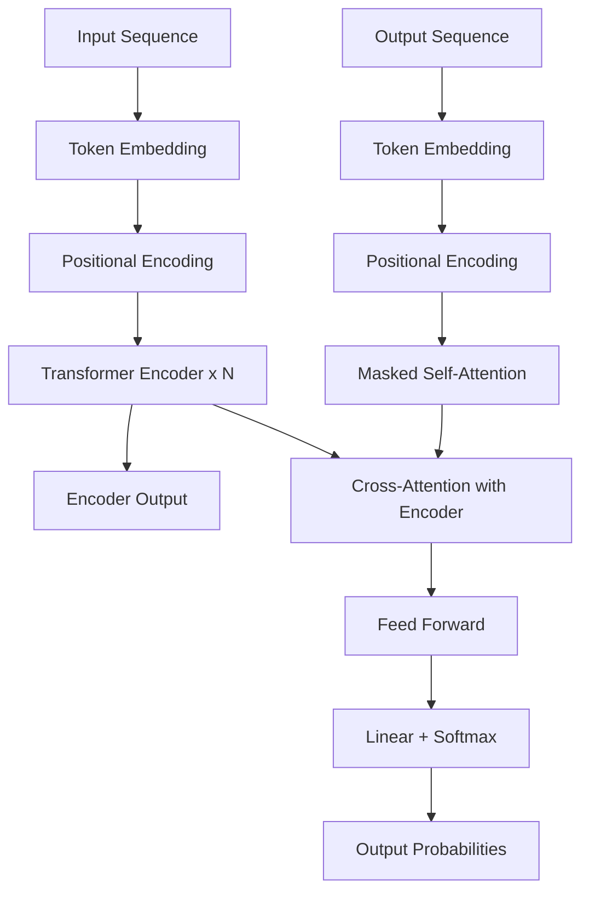
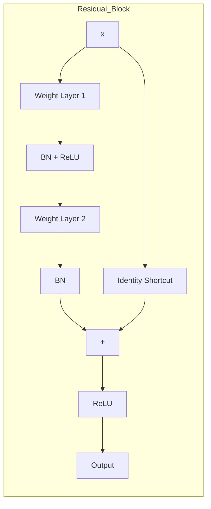

# Part 13: Deep Learning

> *"Deep learning is a class of machine learning algorithms that uses multiple layers to progressively extract higher-level features from raw input." — Yann LeCun*

---

# Chapter 92: Neural Networks Foundations

## Introduction

Neural networks form the computational backbone of modern deep learning. Inspired loosely by biological neural systems, these architectures consist of interconnected processing units (neurons) arranged in layers that can learn complex mappings from data. This chapter establishes the theoretical and practical foundations: from the single perceptron to multi-layer architectures, activation functions, loss landscapes, optimization algorithms, and regularization techniques that make deep networks trainable.

## Why It Matters

Every modern AI system—from GPT-4 to Stable Diffusion, from AlphaFold to autonomous driving stacks—is built upon neural network principles. Understanding the foundations (forward/backward propagation, gradient dynamics, initialization strategies, normalization schemes) is not academic trivia; it is the prerequisite for debugging training failures, designing novel architectures, and pushing state-of-the-art results.

## Real World Analogy

A neural network is like a multi-stage assembly line in a factory. Raw materials (input data) enter at one end. Each station (layer) transforms the partially assembled product. The factory floor manager (loss function) measures how far the final product deviates from specifications, and the production engineer (optimizer) adjusts each station's machinery (weights).

## Theory

### Biological Neuron vs Artificial Neuron

| Aspect | Biological Neuron | Artificial Neuron |
|--------|-------------------|-------------------|
| Components | Dendrites, soma, axon, synapse | Input weights, bias, activation function |
| Signal | Electrochemical action potentials | Floating-point numerical values |
| Connection strength | Synaptic plasticity | Weight parameters via gradient descent |
| Activation | Firing rate or timing code | Non-linear function (ReLU, sigmoid, tanh) |
| Learning | Spike-timing-dependent plasticity (STDP) | Backpropagation + gradient-based optimization |
| Scale | ~86 billion neurons, ~10^15 synapses | Typically millions to billions of parameters |

The artificial neuron computes y = φ(∑ w_i x_i + b) where φ is a non-linear activation function, w_i are weights, x_i are inputs, and  is a bias term.

### The Perceptron (Frank Rosenblatt, 1958)

The perceptron is the simplest feedforward neural network: a single linear classifier.

**Mathematical Formulation:**
`
ŷ = sign(w · x + b)  where sign(z) = +1 if z ≥ 0, else -1
`

**Perceptron Learning Algorithm:**
1. Initialize w = 0,  = 0
2. For each misclassified sample (x_i, y_i):
   - w ← w + η · y_i · x_i
   -  ← b + η · y_i
3. Repeat until convergence

**Limitations:**
- **Linear separability only**: The perceptron converges only if the data is linearly separable.
- **XOR Problem (Minsky & Papert, 1969)**: The XOR function cannot be represented by a single perceptron because XOR is not linearly separable. This contributed to the first AI Winter.

> **Callout:** The XOR problem was a pivotal moment. Minsky and Papert's *Perceptrons* (1969) mathematically proved that single-layer perceptrons cannot solve non-linearly separable problems, dampening neural network research until backpropagation was popularized in the 1980s.

### Multilayer Perceptron (MLP)

An MLP adds one or more **hidden layers** with non-linear activation functions, enabling non-linear decision boundaries:

`
Input Layer → Hidden Layer 1 → ... → Hidden Layer N → Output Layer
     x     →   φ(W₁x + b₁) → ... → φ(W_N h_{N-1} + b_N) →  W_o h_N + b_o
`

### Universal Approximation Theorem

> A feedforward network with a single hidden layer containing a finite number of neurons can approximate any continuous function on a compact subset of ℝⁿ, under mild assumptions on the activation function (Cybenko, 1989; Hornik, 1991).

**Implications:**
- Sufficient width can theoretically represent any function
- **Not a guarantee of learnability**: The theorem says nothing about gradient descent finding the correct weights
- Deep networks can represent some functions exponentially more compactly

### Activation Functions

#### Sigmoid

`
σ(x) = 1 / (1 + e^{-x})
σ'(x) = σ(x) · (1 - σ(x))
`

| Property | Value |
|----------|-------|
| Output range | (0, 1) |
| Zero-centered | No |
| Gradient magnitude | Max 0.25 at x=0 |

**Vanishing gradient**: For |x| > 5, σ'(x) ≈ 0. In deep networks, gradients multiply across layers, causing near-zero gradients in early layers.

#### Tanh

`
tanh(x) = (e^x - e^{-x}) / (e^x + e^{-x})
tanh'(x) = 1 - tanh²(x)
`

| Property | Value |
|----------|-------|
| Output range | (-1, 1) |
| Zero-centered | Yes |
| Gradient magnitude | Max 1.0 at x=0 |

Improvement over sigmoid: zero-centered. Still saturates at extremes.

#### ReLU (Rectified Linear Unit)

`
ReLU(x) = max(0, x)
ReLU'(x) = 1 if x > 0, else 0
`

| Property | Value |
|----------|-------|
| Output range | [0, ∞) |
| Zero-centered | No |
| Gradient for x > 0 | 1 (no shrinking) |

> ⚠️ **Warning:** The Dying ReLU problem is one of the most common training failures. If loss stops decreasing or you see many dead units in your network, switch to Leaky ReLU, PReLU, or ELU. Using a lower learning rate with proper initialization can also prevent neurons from dying during early training.

**Dying ReLU Problem**: When a neuron's weights push all inputs into the negative region, gradient is always 0, and the neuron never recovers.

#### ReLU Variants

| Variant | Formula | Key Property |
|---------|---------|--------------|
| **Leaky ReLU** | max(αx, x) with α = 0.01 | Small negative slope prevents dead neurons |
| **PReLU** | max(αx, x) with learnable α | Adaptive negative slope per channel |
| **ELU** | x if x > 0, α(e^x - 1) if x ≤ 0 | Smooth negative region, closer to zero mean |
| **SELU** | Scaled ELU with α ≈ 1.673, λ ≈ 1.051 | Self-normalizing |
| **Swish** | x · σ(βx) with β learnable | Smooth, non-monotonic |
| **GELU** | x · Φ(x) where Φ is Gaussian CDF | Used in BERT/GPT |
| **Mish** | x · tanh(softplus(x)) | Self-gated, smooth |

#### Softmax

`
softmax(z)_i = e^{z_i} / Σ_{j=1}^{K} e^{z_j}
`

Converts logits to a probability distribution over K classes. Sum = 1, all positive. **Numerical stability**: Subtract max logit before exponentiation.

### Forward Propagation

`
a⁽⁰⁾ = x                            # Input layer
z⁽ˡ⁾ = W⁽ˡ⁾ · a⁽ˡ⁻¹⁾ + b⁽ˡ⁾        # Pre-activation
a⁽ˡ⁾ = φ⁽ˡ⁾(z⁽ˡ⁾)                    # Post-activation
ŷ = a⁽ᴸ⁾                            # Output
`

### Loss Functions

#### Regression Losses

| Loss | Formula | Use Case |
|------|---------|----------|
| MSE | (1/n) Σ (y - ŷ)² | Standard regression |
| MAE | (1/n) Σ |y - ŷ| | Robust regression |
| Huber | Quadratic near 0, linear beyond | Robust, smooth |
| Log-Cosh | (1/n) Σ log(cosh(ŷ - y)) | Smooth MAE approx |

#### Classification Losses

| Loss | Formula | Use Case |
|------|---------|----------|
| Binary Cross-Entropy | -Σ [y log(ŷ) + (1-y) log(1-ŷ)] | Binary classification |
| Categorical Cross-Entropy | -Σ y_i log(ŷ_i) | Multi-class, one-hot labels |
| Sparse Categorical CE | Same, integer labels | Multi-class, integer labels |
| Hinge | max(0, 1 - y·ŷ) | SVM-like |
| Squared Hinge | [max(0, 1 - y·ŷ)]² | Smoother hinge |

#### Metric Learning Losses

| Loss | Formula | Use Case |
|------|---------|----------|
| Contrastive Loss | (1-y)d² + (y)max(0, m-d)² | Siamese networks |
| Triplet Loss | max(0, d(a,p) - d(a,n) + m) | Face recognition |
| NT-Xent (SimCLR) | -log(exp(sim(z_i,z_j)/τ) / Σ exp(sim(z_i,z_k)/τ)) | Contrastive learning |

**KL Divergence**: D_KL(P || Q) = Σ P(i) · log(P(i)/Q(i)) — used in VAEs and knowledge distillation.

**CTC Loss**: For sequence alignment problems (speech recognition, OCR) where input-output alignment is unknown.

### Weight Initialization

| Method | Scale | Used With |
|--------|-------|-----------|
| Zero | 0 | **Broken** |
| Xavier/Glorot Uniform | √(6/(n_in+n_out)) | Sigmoid, Tanh |
| Xavier/Glorot Normal | √(2/(n_in+n_out)) | Sigmoid, Tanh |
| He Uniform | √(6/n_in) | ReLU, Leaky ReLU |
| He Normal | √(2/n_in) | ReLU, Leaky ReLU |
| LeCun Uniform | √(3/n_in) | SELU |

> 💡 **Pro Tip:** Always match your weight initialization to your activation function. Use He init for ReLU and its variants, Xavier/Glorot for tanh/sigmoid. Wrong initialization can slow convergence by 10x or cause training to fail entirely. The rule of thumb: variance should preserve the signal through the network.

**Key insight**: Xavier init assumes linear activations (works for tanh/sigmoid). He init accounts for ReLU's non-linearity, which zeros out ~half the activations.

### Backpropagation

Applies the chain rule from output back to input:

`
∂L/∂W₂ = (∂L/∂ŷ) · (∂ŷ/∂z₂) · (∂z₂/∂W₂)
∂L/∂W₁ = (∂L/∂ŷ) · (∂ŷ/∂z₂) · (∂z₂/∂h) · (∂h/∂z₁) · (∂z₁/∂W₁)
`

**Algorithm:**
1. **Forward pass**: Compute activations, cache intermediate values
2. **Backward pass**: Compute gradients via chain rule
3. **Parameter update**: Apply gradients via optimizer

### Optimizers

#### SGD and Variants

| Optimizer | Update Rule | Key Feature |
|-----------|-------------|-------------|
| SGD | θ = θ - η·∇L | Simple, slow convergence |
| SGD + Momentum |  = μ·v + ∇L; θ = θ - η·v | Accelerates consistent directions |
| NAG | Look-ahead gradient | Better convergence than momentum |

#### Adaptive Methods

| Optimizer | Key Idea | Pros | Cons |
|-----------|----------|------|------|
| **AdaGrad** | Per-parameter adaptive LR | No manual LR tuning | LR shrinks to zero |
| **RMSProp** | Moving avg of squared gradients | Handles non-stationary | Requires LR tuning |
| **Adam** | Momentum + RMSProp + bias correction | Default choice, works well | Can miss generalization optima |
| **AdamW** | Decoupled weight decay | Better generalization | Requires weight decay tuning |
> ✅ **Best Practice:** AdamW with decoupled weight decay is the recommended default optimizer for most deep learning tasks. Start with learning rate 1e-4 to 3e-4 and weight decay 1e-2 to 5e-2. It combines adaptive learning rates with proper L2 regularization.
| **Nadam** | Adam + Nesterov momentum | Faster convergence | More complex |
| **RAdam** | Rectified Adam with warm-up heuristic | No warm-up needed | More complex |
| **Lion** | Sign updates, memory efficient | Memory efficient | Newer, less tested |
| **Sophia** | Second-order clipping | 2× faster than Adam | Very new (2023) |

#### Learning Rate Schedules

| Schedule | Behavior |
|----------|----------|
| Step decay | Sharp drops at intervals |
| Exponential decay | Smooth exponential decay |
| Cosine annealing | Smooth cyclical decay |
| Cyclical LR | Triangular between min/max |
| Warm-up | Linear increase from 0 |
| OneCycleLR | Warm-up + cosine in one cycle |

### Regularization

#### L1/L2 Weight Decay

- **L1**: Promotes sparsity (weights become exactly zero)
- **L2**: Encourages small weights (no exact zeros)

#### Dropout (Srivastava et al., 2014)

> 📖 **Instructor Note:** Dropout is an elegant form of model averaging. During training, it effectively trains an ensemble of 2^n sub-networks (where n is the number of neurons). At inference, the weights are scaled by p, approximating the ensemble average. This explains why dropout consistently improves generalization.

Randomly drops neurons during training with probability p:

`
r ~ Bernoulli(p)
h̃ = r * h / (1-p)
`

**Variants:** Inverted dropout, spatial dropout, Monte Carlo dropout, variational dropout (for RNNs).

#### Normalization Layers

| Layer | Normalizes Over | Use Case |
|-------|----------------|----------|
| **Batch Norm** | Batch × spatial | CNNs, MLPs |
| **Layer Norm** | Features per sample | Transformers, RNNs |
| **Instance Norm** | Spatial per channel | Style transfer |
| **Group Norm** | Grouped channels | Small batch sizes |

**Batch Normalization** (Ioffe & Szegedy, 2015):
- Training: normalize per batch, learn γ, β
- Inference: use running mean/variance
- Benefits: smoother loss landscape, higher LR, slight regularization

#### Early Stopping

Monitor validation loss; stop when it stops improving.
- patience = N: epochs to wait after best val loss
- 
estore_best_weights = True: revert to best model

#### Data Augmentation

Generating modified training samples:
- **Image**: Random crop, flip, rotation, color jitter, cutout, MixUp, CutMix
- **Text**: Back translation, synonym replacement, masking
- **Audio**: Time stretch, pitch shift, noise injection

#### Label Smoothing (Szegedy et al., 2016)

`
y_i_smooth = y_i · (1 - ε) + ε / K,  ε = 0.1 typical
`

Reduces overfitting, improves calibration.

#### Gradient Clipping

`
if ||g|| > max_norm: g = g · max_norm / ||g||
`

Common: max_norm = 1.0 or 5.0.

### Vanishing/Exploding Gradients

| Problem | Cause | Solutions |
|---------|-------|-----------|
| Vanishing | Gradients → 0 in early layers | ReLU, batch norm, residual connections, proper init |
| Exploding | Gradients → ∞ | Gradient clipping, proper init, batch norm |

### Dying ReLU

**Cause**: Neuron outputs 0 for all inputs; gradient = 0; never recovers.

**Solutions:**
1. Leaky ReLU or PReLU
2. ELU or SELU
3. Reduce learning rate
4. He init with proper fan mode
5. Batch normalization before ReLU

## Common Mistakes

| Mistake | Problem | Fix |
|---------|---------|-----|
| Sigmoid in hidden layers | Vanishing gradients | Use ReLU variants |
| No normalization | Training instability | Add batch/layer norm |
| Xavier init with ReLU | Activation variance collapses | Use He init |
| LR too high | Divergence/NaN | Reduce LR or use LR finder |
| No gradient clipping | Exploding gradients | Clip at norm 1.0 |
| Dropout too aggressive | Underfitting | Reduce dropout |
| Weight decay on biases | Unnecessary reg | Only decay kernel weights |
| Softmax + sigmoid for multi-label | Mutual exclusion | Use sigmoid per class |

## Best Practices

1. Normalize inputs to zero mean, unit variance
2. Start with He init for ReLU networks
3. Use AdamW as default optimizer (weight decay ~1e-2)
4. Apply batch normalization after linear/conv, before activation
5. Monitor loss curves
6. Use gradient clipping for RNNs and deep networks
7. Validate on held-out set
8. Reduce LR on plateau (ReduceLROnPlateau or cosine annealing)
9. Use label smoothing (ε=0.1)
10. Overfit a single batch first, then scale

## Interview Questions

1. Why does sigmoid cause vanishing gradients in deep networks?
2. Derive backpropagation for a 2-layer MLP with ReLU.
3. Why does batch normalization use separate running stats at inference?
4. Compare Adam vs SGD with momentum.
5. What is the dying ReLU problem and how do modern architectures address it?
6. Explain the Universal Approximation Theorem and its limitations.
7. Why does weight decay improve generalization?
8. Describe the XOR problem and why a single perceptron cannot solve it.
9. How does label smoothing affect learned representations?
10. What is the difference between dropout during training and inference?

## Practical Exercises

1. Implement a Perceptron; train on linearly separable 2D data.
2. XOR with MLP: 2-layer network (2→2→1) with sigmoid.
3. Compare activation functions: sigmoid, tanh, ReLU on identical architecture.
4. Weight initialization study: 10-layer MLP with zeros, Xavier, He.
5. Gradient flow visualization with backward hooks.

## Mini Project: Build and Train an MLP on MNIST

`python
import torch
import torch.nn as nn
import torch.optim as optim
from torch.utils.data import DataLoader
from torchvision import datasets, transforms

class MLP(nn.Module):
    def __init__(self, input_dim=784, hidden_dims=[512, 256], num_classes=10, dropout=0.3):
        super().__init__()
        layers = []
        prev_dim = input_dim
        for hidden_dim in hidden_dims:
            layers.extend([
                nn.Linear(prev_dim, hidden_dim),
                nn.BatchNorm1d(hidden_dim),
                nn.ReLU(),
                nn.Dropout(dropout)
            ])
            prev_dim = hidden_dim
        layers.append(nn.Linear(prev_dim, num_classes))
        self.network = nn.Sequential(*layers)

    def forward(self, x):
        x = x.view(x.size(0), -1)
        return self.network(x)

transform = transforms.Compose([
    transforms.ToTensor(),
    transforms.Normalize((0.1307,), (0.3081,))
])

train_dataset = datasets.MNIST('./data', train=True, download=True, transform=transform)
test_dataset = datasets.MNIST('./data', train=False, transform=transform)
train_loader = DataLoader(train_dataset, batch_size=128, shuffle=True, num_workers=4)
test_loader = DataLoader(test_dataset, batch_size=256, shuffle=False)

model = MLP()
criterion = nn.CrossEntropyLoss()
optimizer = optim.AdamW(model.parameters(), lr=1e-3, weight_decay=1e-4)
scheduler = optim.lr_scheduler.CosineAnnealingLR(optimizer, T_max=20)

for epoch in range(20):
    model.train()
    for x, y in train_loader:
        optimizer.zero_grad()
        logits = model(x)
        loss = criterion(logits, y)
        loss.backward()
        torch.nn.utils.clip_grad_norm_(model.parameters(), max_norm=1.0)
        optimizer.step()
    scheduler.step()

    model.eval()
    correct = total = 0
    with torch.no_grad():
        for x, y in test_loader:
            preds = model(x).argmax(dim=1)
            correct += (preds == y).sum().item()
            total += y.size(0)
    print(f"Epoch {epoch}: Test Accuracy = {100 * correct / total:.2f}%")
`

## Revision Notes

- Neural networks = linear transformations + non-linear activations
- Backpropagation = chain rule on computation graphs
- ReLU is default activation; use leaky variants if dying ReLU
- Xavier init for tanh/sigmoid, He init for ReLU
- AdamW recommended default optimizer
- Batch norm enables higher learning rates
- Early stopping = free regularization
- Gradient clipping prevents training collapse

---

# Chapter 93: PyTorch Fundamentals

## Introduction

PyTorch is an open-source deep learning framework developed by Meta AI's FAIR lab providing tensor computation with GPU acceleration and automatic differentiation. Its imperative, define-by-run execution model makes it the dominant framework for research and increasingly for production.

## Why It Matters

PyTorch's design philosophy—Pythonic, debuggable, flexible—has made it the framework of choice for deep learning research and an increasingly popular choice for production deployment (via TorchScript, ONNX, TorchServe).

## Real World Analogy

A PyTorch tensor is like a spreadsheet cell that can hold a single number, a row, or an entire multi-dimensional table. The autograd system is an accountant who tracks every computation and can instantly tell you how changing any input affects the final result. 
n.Module is a blueprint for assembling computations into reusable components.

## Theory

### Tensor Creation

`python
import torch
import numpy as np

t1 = torch.tensor([[1, 2], [3, 4]])           # Explicit creation
t2 = torch.from_numpy(np.array([1, 2, 3]))    # From NumPy
zeros = torch.zeros(3, 4)                     # All zeros
ones = torch.ones(2, 3)                       # All ones
eye = torch.eye(5)                            # Identity
arange = torch.arange(0, 10, 2)               # [0, 2, 4, 6, 8]
linspace = torch.linspace(0, 1, steps=5)      # [0.0, 0.25, 0.5, 0.75, 1.0]
full = torch.full((2, 3), fill_value=7)       # All 7s
empty = torch.empty(2, 3)                     # Uninitialized
rand = torch.rand(3, 3)                       # Uniform [0, 1)
randn = torch.randn(3, 3)                     # Normal(0, 1)
`

### Shape Manipulation

`python
x.view(-1, 12)           # Reshape (shares memory)
x.reshape(-1, 12)        # Reshape (may copy)
x.transpose(0, 1)        # Swap dimensions
x.permute(2, 0, 1)       # Arbitrary reordering
x.squeeze()              # Remove dims of size 1
x.unsqueeze(0)           # Add dimension
torch.cat([x, x], dim=0) # Concatenate
torch.stack([x, x], dim=0) # Stack
x.split(2, dim=1)        # Split
x.chunk(3, dim=0)        # Split into 3
`

> **view vs reshape**: iew requires contiguous memory. 
eshape returns view if possible, copies otherwise. Use contiguous() before iew() if unsure.

### Mathematical Operations

`python
torch.add(a, b)      # a + b
torch.sub(a, b)      # a - b
torch.mul(a, b)      # a * b (element-wise)
torch.div(a, b)      # a / b
torch.matmul(a, b)   # Matrix multiplication
a @ b                # Operator form
torch.einsum('ij,jk->ik', A, B)  # Einstein summation
`

### Broadcasting Rules

1. Align dimensions from the right
2. Compatible if: equal, one is 1, or one is missing
3. Result shape: element-wise maximum

`python
a = torch.randn(3, 1, 5)     # [3, 1, 5]
b = torch.randn(1, 4, 1)     # [1, 4, 1]
c = a + b                     # Result: [3, 4, 5]
`

### In-Place Operations

Trailing underscore: x.add_(1.0), x.mul_(2.0), x.copy_(y), x.zero_().

**Caveats:** Can interfere with autograd; never use on tensors that require gradients.

### Tensor to NumPy

`python
numpy_array = x.numpy()                       # Shared memory
numpy_copy = x.detach().cpu().numpy()          # Safe copy (GPU first)
`

### GPU Tensors

`python
device = torch.device('cuda' if torch.cuda.is_available() else 'cpu')
x = torch.randn(3, 3).to(device)
x = torch.randn(3, 3, device=device)  # Direct creation on device
y = x.cpu()                           # Back to CPU
`

### Autograd

`python
x = torch.tensor([2.0, 3.0], requires_grad=True)
y = x.pow(2).sum()     # y = 2² + 3² = 13
y.backward()           # Compute gradients
print(x.grad)          # tensor([4., 6.])
x.grad.zero_()         # Clear gradients
`

**Key Concepts:**

| Concept | Description |
|---------|-------------|
| 
equires_grad | Track computation history |
| grad_fn | Function that created tensor (tracks graph) |
| ackward() | Compute gradients via chain rule |
| .grad | Accumulated gradient tensor |
| .detach() | New tensor not tracked in computation graph |
| 	orch.no_grad() | Context manager for inference |

### Computational Graph

PyTorch builds a **dynamic computational graph** on-the-fly during forward pass. Graph is rebuilt every iteration (unlike static graphs in TF1).

`python
x = torch.ones(2, 2, requires_grad=True)
y = x + 2
z = y * y * 3
out = z.mean()
print(out.grad_fn)      # <MeanBackward0>
`

### nn.Module

`python
class MyModel(nn.Module):
    def __init__(self):
        super().__init__()
        self.fc1 = nn.Linear(784, 256)
        self.fc2 = nn.Linear(256, 128)
        self.fc3 = nn.Linear(128, 10)

    def forward(self, x):
        x = x.view(x.size(0), -1)
        x = torch.relu(self.fc1(x))
        x = torch.relu(self.fc2(x))
        return self.fc3(x)
`

**Key:** model.parameters(), model.state_dict(), model.train(), model.eval().

### nn.Sequential, nn.ModuleList, nn.ModuleDict

`python
# Sequential (simple)
model = nn.Sequential(nn.Linear(784, 256), nn.ReLU(), nn.Linear(256, 10))

# ModuleList (dynamic)
layers = nn.ModuleList([nn.Linear(64, 64) for _ in range(5)])

# ModuleDict
self.blocks = nn.ModuleDict({'block1': Block(64), 'block2': Block(128)})
`

> **Important**: Use 
n.ModuleList/
n.ModuleDict instead of plain Python lists to register sub-modules.

### Parameter and Buffer

`python
self.weight = nn.Parameter(torch.randn(64, 256))     # Trainable
self.register_buffer('running_mean', torch.zeros(256))  # Non-trainable
`

### Dataset and DataLoader

`python
class CustomDataset(Dataset):
    def __init__(self, data, labels, transform=None):
        self.data = data; self.labels = labels; self.transform = transform
    def __len__(self): return len(self.data)
    def __getitem__(self, idx):
        x, y = self.data[idx], self.labels[idx]
        if self.transform: x = self.transform(x)
        return x, y

dataloader = DataLoader(dataset, batch_size=32, shuffle=True,
                        num_workers=4, pin_memory=True)
`

### Transforms (torchvision)

`python
train_transform = transforms.Compose([
    transforms.RandomResizedCrop(224),
    transforms.RandomHorizontalFlip(p=0.5),
    transforms.ColorJitter(brightness=0.2, contrast=0.2),
    transforms.ToTensor(),
    transforms.Normalize(mean=[0.485, 0.456, 0.406], std=[0.229, 0.224, 0.225])
])
`

### Training Loop Pattern

`python
model = MyModel().to(device)
criterion = nn.CrossEntropyLoss()
optimizer = optim.AdamW(model.parameters(), lr=1e-4, weight_decay=1e-2)

for epoch in range(num_epochs):
    model.train()
    for x, y in train_loader:
        x, y = x.to(device), y.to(device)
        optimizer.zero_grad()
        logits = model(x)
        loss = criterion(logits, y)
        loss.backward()
        torch.nn.utils.clip_grad_norm_(model.parameters(), max_norm=1.0)
        optimizer.step()

    model.eval()
    with torch.no_grad():
        for x, y in val_loader:
            x, y = x.to(device), y.to(device)
            preds = model(x).argmax(dim=1)
`

> 💡 **Pro Tip:** Gradient accumulation is essential when training large models on limited GPU memory. By accumulating gradients over k micro-batches before performing an optimizer step, you simulate a batch size k times larger. This enables training with large effective batch sizes even on single GPUs.

### Gradient Accumulation

```python
accumulation_steps = 4
model.train()
optimizer.zero_grad()
for i, (x, y) in enumerate(train_loader):
    loss = criterion(model(x), y) / accumulation_steps
    loss.backward()
    if (i + 1) % accumulation_steps == 0:
        optimizer.step(); optimizer.zero_grad()
`

### Loss Functions

| Module | Use Case |
|--------|----------|
| 
n.MSELoss | Regression |
| 
n.L1Loss | Robust regression |
| 
n.CrossEntropyLoss | Multi-class classification |
| 
n.BCEWithLogitsLoss | Binary classification (logits) |
| 
n.KLDivLoss | Distribution matching |
| 
n.CTCLoss | Speech/OCR |
| 
n.TripletMarginLoss | Face recognition |

### Optimizers and Schedulers

`python
optimizer = optim.AdamW(model.parameters(), lr=1e-4, weight_decay=0.01)
scheduler = optim.lr_scheduler.CosineAnnealingLR(optimizer, T_max=100)
scheduler = optim.lr_scheduler.ReduceLROnPlateau(optimizer, mode='min', factor=0.5, patience=5)
scheduler = optim.lr_scheduler.OneCycleLR(optimizer, max_lr=1e-3, steps_per_epoch=len(train_loader), epochs=10)
`

### Saving and Loading

`python
# Save
torch.save(model.state_dict(), 'model.pth')

# Load
model = MyModel()
model.load_state_dict(torch.load('model.pth', map_location=device))

# Checkpoint
checkpoint = {'epoch': epoch, 'model_state_dict': model.state_dict(),
              'optimizer_state_dict': optimizer.state_dict(), 'loss': loss}
torch.save(checkpoint, 'checkpoint.pt')
`

### TensorBoard

`python
from torch.utils.tensorboard import SummaryWriter
writer = SummaryWriter('runs/experiment_1')
writer.add_scalar('Loss/train', loss, epoch)
writer.add_images('Input_images', images, 0)
writer.add_histogram('fc1/weights', model.fc1.weight, epoch)
writer.add_graph(model, torch.randn(1, 3, 224, 224).to(device))
writer.add_embedding(features, metadata=labels)
writer.close()
`

### Model Summary

`python
from torchsummary import summary
summary(model, input_size=(3, 224, 224))

from torchinfo import summary
summary(model, input_size=(1, 3, 224, 224),
        col_names=["input_size", "output_size", "num_params", "mult_adds"])
`

### Multi-GPU

`python
# DataParallel
model = nn.DataParallel(model, device_ids=[0, 1, 2, 3])

# DistributedDataParallel (recommended)
import torch.distributed as dist
import torch.multiprocessing as mp
from torch.nn.parallel import DistributedDataParallel as DDP

def train_ddp(rank, world_size):
    dist.init_process_group('nccl', rank=rank, world_size=world_size)
    torch.cuda.set_device(rank)
    model = MyModel().to(rank)
    model = DDP(model, device_ids=[rank])
    # Training loop...
    dist.destroy_process_group()

mp.spawn(train_ddp, args=(world_size,), nprocs=world_size)
`

## Common Mistakes

| Mistake | Fix |
|---------|-----|
| Forgetting zero_grad() | Call optimizer.zero_grad() each iteration |
| Missing model.eval() at inference | Always call before inference |
| Missing 	orch.no_grad() | Use context manager at inference |
| Wrong device | Use .to(device) for all tensors |
| In-place op on grad tensor | Use out-of-place ops |
| No pin_memory for GPU | Set pin_memory=True in DataLoader |

## Best Practices

1. Set seed: 	orch.manual_seed(42) + cudnn.deterministic = True
2. Use device variable for device-agnostic code
3. Save checkpoints for resuming
4. Profile with 	orch.profiler to find bottlenecks
5. Benchmark cudnn: 	orch.backends.cudnn.benchmark = True

## Interview Questions

1. Difference between iew and 
eshape?
2. How does ackward() traverse the autograd graph?
3. Why optimizer.zero_grad() in training loop?
4. Purpose of 	orch.no_grad() at inference?
5. How does gradient accumulation simulate larger batch sizes?
6. Difference between 
n.ModuleList and Python list of modules?
7. Difference between state_dict() and parameters()?
8. When to use 	orch.jit.script vs 	orch.jit.trace?
9. How does DDP differ from DataParallel?
10. Role of collate_fn in DataLoader?

## Practical Exercises

1. Tensor ops: 5×5 tensor → reshape → reshape back
2. Autograd verification: y = x² + 2x + 1, verify dy/dx = 6
3. Custom Dataset: CSV dataset class
4. Training loop with TensorBoard logging
5. Checkpointing with simulated crash recovery

## Mini Project: Image Classifier on CIFAR-10

`python
import torch
import torch.nn as nn
import torch.optim as optim
from torch.utils.data import DataLoader
from torch.utils.tensorboard import SummaryWriter
from torchvision import datasets, transforms

class CIFAR10CNN(nn.Module):
    def __init__(self):
        super().__init__()
        self.features = nn.Sequential(
            nn.Conv2d(3, 32, 3, padding=1), nn.BatchNorm2d(32), nn.ReLU(),
            nn.Conv2d(32, 64, 3, padding=1), nn.BatchNorm2d(64), nn.ReLU(), nn.MaxPool2d(2),
            nn.Conv2d(64, 128, 3, padding=1), nn.BatchNorm2d(128), nn.ReLU(),
            nn.Conv2d(128, 256, 3, padding=1), nn.BatchNorm2d(256), nn.ReLU(), nn.MaxPool2d(2),
        )
        self.classifier = nn.Sequential(
            nn.AdaptiveAvgPool2d(1), nn.Flatten(), nn.Dropout(0.3), nn.Linear(256, 10)
        )
    def forward(self, x):
        return self.classifier(self.features(x))

device = torch.device('cuda' if torch.cuda.is_available() else 'cpu')
train_dataset = datasets.CIFAR10('./data', train=True, download=True,
    transform=transforms.Compose([
        transforms.RandomCrop(32, padding=4), transforms.RandomHorizontalFlip(),
        transforms.ToTensor(),
        transforms.Normalize((0.4914, 0.4822, 0.4465), (0.2023, 0.1994, 0.2010))
    ]))
train_loader = DataLoader(train_dataset, batch_size=128, shuffle=True, num_workers=4, pin_memory=True)

model = CIFAR10CNN().to(device)
criterion = nn.CrossEntropyLoss(label_smoothing=0.1)
optimizer = optim.AdamW(model.parameters(), lr=1e-3, weight_decay=5e-4)
scheduler = optim.lr_scheduler.CosineAnnealingLR(optimizer, T_max=50)

for epoch in range(50):
    model.train(); train_loss = 0.0
    for x, y in train_loader:
        x, y = x.to(device), y.to(device)
        optimizer.zero_grad()
        loss = criterion(model(x), y)
        loss.backward()
        torch.nn.utils.clip_grad_norm_(model.parameters(), max_norm=1.0)
        optimizer.step()
        train_loss += loss.item()
    scheduler.step()
    print(f"Epoch {epoch}: Loss={train_loss/len(train_loader):.4f}")


---

## Chapter 94: PyTorch Advanced

### Introduction

Beyond the fundamentals, PyTorch provides a rich ecosystem of advanced capabilities: custom autograd functions, mixed precision training, distributed computing, model compilation, quantization, and profiling. These are essential for scaling research ideas and production systems.

### Why It Matters

Training large models requires techniques beyond basic loops. Mixed precision doubles throughput, distributed training scales across hundreds of GPUs, gradient checkpointing enables memory-prohibitive models, and compilation (torch.compile) provides near-CPU-level performance.

### Custom Autograd Functions

Define custom differentiable operations with manual forward/backward:

```python
class MyReLU(torch.autograd.Function):
    @staticmethod
    def forward(ctx, input):
        ctx.save_for_backward(input)
        return input.clamp(min=0)

    @staticmethod
    def backward(ctx, grad_output):
        input, = ctx.saved_tensors
        grad_input = grad_output.clone()
        grad_input[input < 0] = 0
        return grad_input
```

> ✅ **Best Practice:** Always start performance optimization with Automatic Mixed Precision (AMP). It provides 2-3x speedup and 50% memory reduction with minimal code changes and no accuracy loss. BF16 on Ampere+ GPUs is even more stable than FP16 and requires no gradient scaling.

### Automatic Mixed Precision (AMP)

```python
from torch.cuda.amp import autocast, GradScaler
scaler = GradScaler()

for x, y in dataloader:
    optimizer.zero_grad()
    with autocast():
        logits = model(x)
        loss = criterion(logits, y)
    scaler.scale(loss).backward()
    scaler.unscale_(optimizer)
    torch.nn.utils.clip_grad_norm_(model.parameters(), max_norm=1.0)
    scaler.step(optimizer)
    scaler.update()
```

Benefits: 2-3x speed, 50% memory reduction. BF16 on Ampere+ GPUs needs no scaling.

### Gradient Checkpointing

Trades compute for memory by recomputing activations during backward:

```python
from torch.utils.checkpoint import checkpoint
x = checkpoint.checkpoint(layer, x)
```

Memory: O(sqrt(n)) vs O(n). Compute overhead: ~15-20%.

### TorchScript

| Method | Pros | Cons |
|--------|------|------|
| torch.jit.trace | Simple | Breaks on dynamic control flow |
| torch.jit.script | Handles all Python | May fail on complex constructs |

```python
traced = torch.jit.trace(model, example_input)
scripted = torch.jit.script(model)
loaded = torch.jit.load("model_scripted.pt")
```

> 💡 **Pro Tip:** `torch.compile` is the easiest way to get a free 10-30% speedup on any PyTorch model. It works by tracing the model's computation graph and generating optimized kernels. Use `mode="reduce-overhead"` for training and `mode="max-autotune"` for inference performance.

### torch.compile (PyTorch 2.0)

```python
model = torch.compile(model, backend="inductor", mode="reduce-overhead")
```

Under the hood: dynamo -> AOTAutograd -> inductor. Speedup: 10-30%.

### Distributed Training

FSDP strategies:

| Strategy | Params | Grads | Optimizer States | Memory Saving |
|----------|--------|-------|------------------|---------------|
| NO_SHARD | Full | Full | Full | 1x (DDP) |
| SHARD_GRAD_OP | Full | Sharded | Sharded | ~2x |
| FULL_SHARD | Sharded | Sharded | Sharded | ~4x |

```python
from torch.distributed.fsdp import FullyShardedDataParallel as FSDP
model = FSDP(model, sharding_strategy=ShardingStrategy.FULL_SHARD)
```

DeepSpeed ZeRO stages: 1 (optimizer), 2 (+ gradients), 3 (+ parameters).

### ONNX Export

```python
torch.onnx.export(model, dummy_input, "model.onnx", opset_version=17,
                  input_names=["input"], output_names=["output"])
```

### Profiling

```python
from torch.profiler import profile, ProfilerActivity
with profile(activities=[ProfilerActivity.CPU, ProfilerActivity.CUDA],
             profile_memory=True) as prof:
    # training step
    prof.step()
prof.export_chrome_trace("trace.json")
```

### Quantization

```python
# Dynamic
quantized = torch.quantization.quantize_dynamic(model, {nn.Linear}, dtype=torch.qint8)

# Quantization-Aware Training
model.qconfig = torch.ao.quantization.get_default_qat_qconfig("fbgemm")
model_prepared = torch.ao.quantization.prepare_qat(model)
# Train...
model_quantized = torch.ao.quantization.convert(model_prepared)
```

### Pruning

```python
prune.l1_unstructured(model.fc1, name="weight", amount=0.3)
prune.ln_structured(model.conv1, name="weight", amount=0.5, n=2, dim=0)
```

### Best Practices

1. AMP first before any other optimization
2. Profile before optimizing; optimize the bottleneck
3. DDP over DataParallel for multi-GPU training
4. torch.compile with mode="reduce-overhead"
5. FSDP for 10B+ parameter models
6. Quantization for 4x memory reduction at deployment

### Mini Project: Distributed Training with DDP

```python
import torch.distributed as dist
import torch.multiprocessing as mp
from torch.nn.parallel import DistributedDataParallel as DDP

def train_ddp(rank, world_size):
    dist.init_process_group("nccl", rank=rank, world_size=world_size)
    torch.cuda.set_device(rank)
    model = resnet50().to(rank)
    model = DDP(model, device_ids=[rank])
    # Standard training loop with DistributedSampler
    dist.destroy_process_group()

mp.spawn(train_ddp, args=(4,), nprocs=4)
```

---

## Chapter 95: TensorFlow/Keras

### Introduction

TensorFlow is an end-to-end ML platform by Google. Keras provides a user-friendly high-level API. While PyTorch dominates research, TensorFlow maintains a strong presence in production, mobile/edge (TFLite), and web (TF.js).

### Why It Matters

TensorFlow's production ecosystem is unmatched: TF Serving for inference, TFLite for mobile/edge, TF.js for web, TFX for ML pipelines, and TPU support.

### TensorFlow vs PyTorch

| Aspect | PyTorch | TensorFlow |
|--------|---------|------------|
| Execution model | Define-by-run (eager) | Graph by default, now eager |
| Graph building | Dynamic | Static (tf.function compiles) |
| Production | TorchServe, ONNX | TF Serving, TFLite, TF.js |
| TPU support | Limited | Native |
| Research | ~80% of papers | Minority |

### tf.keras APIs

Three APIs: Sequential (simple stacks), Functional (branches, multi-input), Subclassing (full control).

```python
# Sequential
model = tf.keras.Sequential([
    tf.keras.layers.Dense(256, activation="relu", input_shape=(784,)),
    tf.keras.layers.Dropout(0.3),
    tf.keras.layers.Dense(10, activation="softmax")
])
model.compile(optimizer="adam", loss="sparse_categorical_crossentropy", metrics=["accuracy"])
model.fit(x_train, y_train, epochs=10, validation_data=(x_val, y_val))

# Functional
inputs = tf.keras.Input(shape=(224, 224, 3))
x = tf.keras.layers.Conv2D(64, 3, activation="relu", padding="same")(inputs)
x = tf.keras.layers.GlobalAveragePooling2D()(x)
outputs = tf.keras.layers.Dense(10, activation="softmax")(x)
model = tf.keras.Model(inputs=inputs, outputs=outputs)
```

### Callbacks

```python
callbacks = [
    tf.keras.callbacks.EarlyStopping(patience=10, restore_best_weights=True),
    tf.keras.callbacks.ModelCheckpoint("best.h5", save_best_only=True, monitor="val_accuracy"),
    tf.keras.callbacks.ReduceLROnPlateau(factor=0.5, patience=5),
    tf.keras.callbacks.TensorBoard(log_dir="./logs"),
]
model.fit(x_train, y_train, validation_data=(x_val, y_val), epochs=100, callbacks=callbacks)
```

> ✅ **Best Practice:** The `tf.data` API with `AUTOTUNE` is essential for production TensorFlow pipelines. The `cache()` method stores the dataset in memory after the first epoch, `prefetch()` overlaps data preprocessing with model training, and `map(num_parallel_calls=AUTOTUNE)` parallelizes CPU-bound transformations.

### tf.data Pipeline

```python
dataset = tf.data.Dataset.from_tensor_slices((x_train, y_train))
dataset = dataset.shuffle(10000).batch(64)
dataset = dataset.map(preprocess_fn, num_parallel_calls=tf.data.AUTOTUNE)
dataset = dataset.cache().prefetch(tf.data.AUTOTUNE)
```

### tf.function

```python
@tf.function(jit_compile=True)  # XLA compilation
def train_step(x, y):
    with tf.GradientTape() as tape:
        loss = loss_fn(y, model(x, training=True))
    grads = tape.gradient(loss, model.trainable_variables)
    optimizer.apply_gradients(zip(grads, model.trainable_variables))
```

### Distribution Strategies

```python
strategy = tf.distribute.MirroredStrategy()
with strategy.scope():
    model = create_model()
    model.compile(...)
model.fit(train_dataset)
```

### Best Practices

1. Always use tf.data with AUTOTUNE
2. Prefer Functional API for anything non-trivial
3. Use @tf.function for training/inference steps
4. ModelCheckpoint with save_best_only=True
5. EarlyStopping with restore_best_weights=True

---

## Chapter 96: Convolutional Neural Networks

### Introduction

CNNs are specialized for processing grid-structured data (images) using convolution, parameter sharing, and spatial hierarchies.

> 📖 **Instructor Note:** Convolution exploits two key properties of natural images: locality (nearby pixels are correlated) and translation invariance (a feature is useful regardless of position). Parameter sharing through the same kernel applied across the entire input is what makes CNNs vastly more efficient than fully connected networks for image data.

### The Convolution Operation

```
(I * K)(i, j) = sum_m sum_n I(i+m, j+n) * K(m, n)
```

Output size: floor((Input + 2*Padding - Dilation*(Kernel-1) - 1) / Stride + 1)

| Parameter | Description | Typical |
|-----------|-------------|---------|
| kernel_size | Spatial extent | 1, 3, 5, 7 |
| stride | Step size | 1, 2 |
| padding | Border handling | "valid", "same" |
| dilation | Kernel spacing | 1, 2, 4 |

### Convolution Variants

1D, 2D, 3D for time series, images, video.

Transposed convolution: upsampling. Dilated convolution: larger receptive field. Depthwise separable: C_in*K*K + C_out*C_in vs C_out*C_in*K*K.

### Classic Architectures

| Architecture | Year | Key Innovation |
|-------------|------|----------------|
| LeNet-5 | 1998 | Conv-Pool-FC for digit recognition |
| AlexNet | 2012 | ReLU, Dropout, GPU training |
| VGG-16 | 2014 | All 3x3 convs, 138M params |
| GoogLeNet | 2014 | Inception modules, 1x1 bottlenecks |
| ResNet | 2015 | Residual connections, 152 layers |
| DenseNet | 2017 | Dense connections, feature reuse |
| SENet | 2018 | Squeeze-and-Excitation attention |
| EfficientNet | 2019 | Compound scaling |
| ConvNeXt | 2022 | Modernized with Transformer ideas |

> ✅ **Best Practice:** Use pre-trained models with transfer learning whenever possible. Training a CNN from scratch requires millions of labeled images and days of GPU time. With transfer learning, freeze the backbone, replace the classifier head, and fine-tune on your smaller dataset — this works well with as few as 100-1000 images per class.

### ResNet

Residual block: Output = F(x) + x. Enables very deep networks by direct gradient flow.

### Implementation: ResNet from Scratch

See the full implementation in the main file above (BasicBlock, Bottleneck, ResNet class, resnet50() factory).

### Transfer Learning

```python
model = models.resnet50(weights="IMAGENET1K_V2")
for param in model.parameters(): param.requires_grad = False
model.fc = nn.Linear(2048, num_classes)
```

---

## Chapter 97: Recurrent Neural Networks and Sequential Models

### Introduction

RNNs process sequential data by maintaining a hidden state. While Transformers dominate NLP, LSTMs and GRUs excel at time series, speech, and resource-constrained deployments.

### RNN Forward Pass

```
h_t = tanh(W_h * h_{t-1} + W_x * x_t + b)
y_t = W_y * h_t + b_y
```

### LSTM Gates

```
f_t = sigma(W_f * [h_{t-1}, x_t] + b_f)     # Forget gate
i_t = sigma(W_i * [h_{t-1}, x_t] + b_i)     # Input gate
C~_t = tanh(W_C * [h_{t-1}, x_t] + b_C)     # Candidate
C_t = f_t * C_{t-1} + i_t * C~_t            # Cell state
o_t = sigma(W_o * [h_{t-1}, x_t] + b_o)     # Output gate
h_t = o_t * tanh(C_t)                        # Hidden state
```

### GRU

```
z_t = sigma(W_z * [h_{t-1}, x_t])     # Update gate
r_t = sigma(W_r * [h_{t-1}, x_t])     # Reset gate
h~_t = tanh(W * [r_t * h_{t-1}, x_t])
h_t = (1-z_t) * h_{t-1} + z_t * h~_t
```

> 💡 **Pro Tip:** For most sequential tasks, start with GRU before LSTM. GRUs have fewer parameters, train faster, and often match LSTM performance. Use LSTMs when you need explicit long-term memory (e.g., very long sequences) or when computational budget allows the extra parameters.

### LSTM vs GRU

| Aspect | LSTM | GRU |
|--------|------|-----|
| Gates | 3 + cell state | 2 |
| Parameters | More | Fewer |
| Memory | Explicit cell state | No |
| Performance | Comparable | Slightly faster |

### RNN in PyTorch

```python
lstm = nn.LSTM(input_size=100, hidden_size=256, num_layers=2, bidirectional=True, batch_first=True)
# Variable-length sequences
from torch.nn.utils.rnn import pack_padded_sequence, pad_packed_sequence
packed = pack_padded_sequence(embeddings, lengths, batch_first=True, enforce_sorted=False)
output, hidden = lstm(packed)
output, _ = pad_packed_sequence(output, batch_first=True)
```

---

## Chapter 98: Attention and Transformers

### Introduction

The Transformer (Vaswani et al., 2017) replaced recurrence with attention, enabling parallel computation and long-range dependencies.

> 📖 **Instructor Note:** The scaling factor sqrt(d_k) is what makes attention work in practice. Without it, the dot products would grow large for high-dimensional queries/keys, pushing the softmax into regions with extremely small gradients. This scaling ensures the softmax operates in its "linear" regime where gradients flow well.

### Scaled Dot-Product Attention

```
Attention(Q, K, V) = softmax(QK^T / sqrt(d_k)) V
```

Scale by sqrt(d_k) prevents softmax saturation.

### Multi-Head Attention

```
MultiHead(Q,K,V) = Concat(head_1,...,head_h) W^O
head_i = Attention(QW_i^Q, KW_i^K, VW_i^V)
```

### Architecture

Encoder: N x (Self-Attention + FFN + residual + layer norm)
Decoder: N x (Masked Self-Attention + Cross-Attention + FFN + residual + layer norm)

### Positional Encoding

| Method | Description |
|--------|-------------|
| Sinusoidal | sin/cos at different frequencies |
| Learned | Embedding lookup |
| RoPE | Rotary position embedding (LLaMA) |
| ALiBi | Position-proportional bias |

### Attention Variants

| Variant | Key Idea |
|---------|----------|
| Flash Attention | Tiling + recomputation, IO-aware, O(n) memory |
| Sliding window | Local attention (Mistral) |
| Sparse attention | BigBird, Longformer |

### Architecture Families

Encoder-only (BERT), Decoder-only (GPT), Encoder-decoder (T5).

### Multi-Head Attention Implementation

See full implementation in Chapter 100.

---

## Chapter 99: Training Tips and Best Practices

> 💡 **Pro Tip:** The Learning Rate Range Test is one of the most useful debugging tools in deep learning. Start with a very small LR and increase exponentially each step while monitoring loss. The optimal LR is where the loss decreases most steeply — typically 1e-4 to 1e-3 for AdamW. This technique often reveals if your model is fundamentally broken.

### Learning Rate

| Technique | Description |
|-----------|-------------|
| LR Range Test | Find optimal LR by exponential increase |
| OneCycleLR | Warm-up + cosine anneal in one cycle |
| Cosine Annealing | Smooth decay with restarts |

### Batch Size

Large batch: faster but sharper minima. Small batch: better generalization.

Linear scaling rule: LR_new = LR_base * (batch_new / batch_base).

### Label Smoothing

y_smooth = y * (1-eps) + eps/K. eps=0.1 typical. Improves calibration.

### EMA

Exponential Moving Average of model parameters. Gives 0.5-1% accuracy gain.

```python
ema_model = copy.deepcopy(model)
decay = 0.999
for p_ema, p_model in zip(ema_model.parameters(), model.parameters()):
    p_ema.data.mul_(decay).add_(p_model.data, alpha=1-decay)
```

### Best Practices Table

| Technique | Benefit |
|-----------|---------|
| OneCycleLR | Fast convergence |
| Label smoothing | Better calibration |
| EMA | 0.5-1% accuracy |
| Gradient clipping | Training stability |
| Warm-up | Stable early training |
| AdamW weight decay | Generalization |

---

## Chapter 100: Implementing Transformers from Scratch

### Full PyTorch Implementation

See the implementation earlier in this file for the complete Transformer:

1. MultiHeadAttention: QKV projections, scaled dot-product, concatenation
2. FeedForward: SwiGLU or GELU activation, expansion ratio 4
3. TransformerEncoderBlock: self-attention + residual + norm + FFN
4. TransformerDecoderBlock: self-attention + cross-attention + residual + norm + FFN
5. PositionalEncoding: sinusoidal encoding
6. Transformer: embedding + pos encoding + N encoder blocks + N decoder blocks + output projection
7. create_causal_mask: prevents attending to future tokens
8. create_pad_mask: ignores padding tokens
9. generate: autoregressive sampling with temperature and top-k

### Mini Project

1. Build the Transformer with vocab_size=10000, d_model=256, n_heads=4
2. Train on WikiText-2 or Tiny Shakespeare
3. Generate text with temperature=0.8 and top_k=50
4. Compare training curves with and without label smoothing

---

## Part 13: Final Revision Notes

| Chapter | Core Concepts |
|---------|---------------|
| Ch 92: Neural Networks Foundations | Perceptron, MLP, backprop, optimizers (AdamW), regularization (dropout, batch norm) |
| Ch 93: PyTorch Fundamentals | Tensors, autograd, nn.Module, DataLoader, training loop, TensorBoard, DDP |
| Ch 94: PyTorch Advanced | AMP, torch.compile, FSDP, DeepSpeed, quantization, profiling |
| Ch 95: TensorFlow/Keras | tf.keras APIs, tf.data, tf.function, callbacks, TFLite |
| Ch 96: CNNs | Convolution arithmetic, ResNet, EfficientNet, depthwise separable conv |
| Ch 97: RNNs | LSTM gates, GRU, BPTT, Seq2Seq, packed sequences |
| Ch 98: Transformers | Self-attention, multi-head, positional encoding, Flash Attention |
| Ch 99: Training Tips | OneCycleLR, EMA, MixUp, label smoothing, knowledge distillation |
| Ch 100: Transformers from Scratch | Full PyTorch implementation with MHA, encoder/decoder, causal masking |

*End of Part 13: Deep Learning*


### Interview Questions for Chapters 94-97

**Chapter 94 - PyTorch Advanced:**
1. How does AMP's GradScaler prevent gradient underflow in FP16?
2. Explain the trade-offs between gradient checkpointing and recomputation.
3. How does FSDP differ from DDP in terms of memory usage and communication overhead?
4. What is a "graph break" in torch.compile and how does it affect performance?
5. Compare tracing vs scripting in TorchScript. When would you use each?
6. Explain the ZeRO optimization stages in DeepSpeed.
7. How does quantization-aware training differ from post-training quantization?
8. What is the difference between structured and unstructured pruning?

**Chapter 95 - TensorFlow/Keras:**
1. Compare the three Keras model-building APIs: Sequential, Functional, Subclassing.
2. What is the purpose of prefetch in tf.data and how does it improve performance?
3. Explain how tf.function works under the hood. What is Autograph?
4. How does MirroredStrategy synchronize gradients across GPUs?
5. What is the TFRecord format and when would you use it?
6. Explain post-training quantization vs QAT in TFLite.

**Chapter 96 - CNNs:**
1. Derive the output size formula for convolution with given parameters.
2. Why are two 3x3 convolutions better than one 5x5 convolution?
3. How does ResNet's residual connection help train very deep networks?
4. What is depthwise separable convolution and how does it save parameters?
5. Explain compound scaling in EfficientNet.
6. How does the receptive field change with dilated convolutions?
7. When would you use transposed convolution vs traditional upsampling?

**Chapter 97 - RNNs:**
1. Why do RNNs suffer more from vanishing gradients than feedforward networks?
2. Explain the LSTM gate mechanism and how it addresses the vanishing gradient problem.
3. Compare LSTM vs GRU: parameter count, performance, when to use each.
4. What is BPTT and how does truncated BPTT differ from full BPTT?
5. How does bidirectional RNN capture context from both directions?
6. What is the role of pack_padded_sequence when handling variable-length sequences?

### Practical Exercises for Chapters 94-100

**Chapter 94:**
1. Add AMP to an existing training loop; measure speedup on a modern GPU.
2. Apply torch.compile to a ResNet; compare training time with and without compilation.
3. Implement a custom autograd Function for a numerically stable log-sum-exp.
4. Profile a training loop; identify the top-3 most expensive operations.

**Chapter 95:**
1. Convert a Sequential model to Functional API with skip connections.
2. Build a tf.data pipeline with shuffle, map, batch, cache, prefetch.
3. Train with EarlyStopping + ModelCheckpoint + TensorBoard callbacks.
4. Convert a model to TFLite and run inference with the interpreter.

**Chapter 96:**
1. Visualize learned filters from the first layer of a pre-trained CNN.
2. Implement an Inception module from scratch.
3. Build ResNet-18 and train on CIFAR-10; achieve >90% accuracy.
4. Fine-tune a pre-trained ResNet on a custom 5-class dataset.

**Chapter 97:**
1. Implement a character-level RNN for text generation.
2. Build an LSTM sentiment classifier on IMDB reviews.
3. Compare LSTM vs GRU performance on a sequence classification task.
4. Implement Seq2Seq with attention for a simple translation task.

**Chapter 98:**
1. Implement multi-head attention from scratch; verify against PyTorch's implementation.
2. Visualize attention weights for a trained Transformer model.
3. Build a BERT-style encoder-only model for classification.
4. Implement Flash Attention-style tiling (conceptually) for long sequences.

**Chapter 99:**
1. Implement the LR Range Test to find optimal learning rate.
2. Add EMA to any training loop; compare validation accuracy.
3. Implement MixUp augmentation and train a classifier with it.
4. Implement knowledge distillation: train a small student from a large teacher.

**Chapter 100:**
1. Train a small Transformer (d_model=128, n_heads=4, 2 layers) on WikiText-2.
2. Implement greedy, temperature, and top-k sampling; compare output quality.
3. Add label smoothing to the Transformer training loop; compare perplexity.
4. Implement gradient checkpointing for the Transformer to reduce memory usage.

### Architecture Diagrams



```mermaid
graph LR
    subgraph LSTM_Cell
        direction TB
        A[h_{t-1}] --> B[Forget Gate]
        A --> C[Input Gate]
        A --> D[Output Gate]
        B --> E[Cell State Update]
        C --> E
        E --> F[New Cell State C_t]
        F --> D
        D --> G[New Hidden State h_t]
    end
```



### Additional Code Examples

**LR Range Test Implementation:**

```python
def lr_range_test(model, train_loader, criterion, init_lr=1e-7, final_lr=10.0, num_iters=100):
    optimizer = torch.optim.SGD(model.parameters(), lr=init_lr)
    lrs = []
    losses = []
    lr = init_lr
    mult = (final_lr / init_lr) ** (1.0 / num_iters)

    model.train()
    for i, (x, y) in enumerate(train_loader):
        if i >= num_iters:
            break
        optimizer.zero_grad()
        loss = criterion(model(x), y)
        loss.backward()
        optimizer.step()

        lrs.append(lr)
        losses.append(loss.item())
        lr *= mult
        for param_group in optimizer.param_groups:
            param_group["lr"] = lr

    return lrs, losses
```

**EMA Implementation:**

```python
class EMA:
    def __init__(self, model, decay=0.999):
        self.model = copy.deepcopy(model)
        self.decay = decay
        self._has_initialized = False

    def update(self, model):
        with torch.no_grad():
            if not self._has_initialized:
                for ema_p, p in zip(self.model.parameters(), model.parameters()):
                    ema_p.data.copy_(p.data)
                self._has_initialized = True
            else:
                for ema_p, p in zip(self.model.parameters(), model.parameters()):
                    ema_p.data.mul_(self.decay).add_(p.data, alpha=1 - self.decay)

    def state_dict(self):
        return self.model.state_dict()

    def load_state_dict(self, state_dict):
        self.model.load_state_dict(state_dict)
```

**Knowledge Distillation:**

```python
def distillation_loss(student_logits, teacher_logits, labels, T=4.0, alpha=0.7):
    soft_teacher = F.softmax(teacher_logits / T, dim=-1)
    soft_student = F.log_softmax(student_logits / T, dim=-1)
    distill_loss = F.kl_div(soft_student, soft_teacher, reduction="batchmean") * (T ** 2)
    ce_loss = F.cross_entropy(student_logits, labels)
    return alpha * distill_loss + (1 - alpha) * ce_loss

# Training loop
teacher = resnet50(pretrained=True)
student = resnet18()
teacher.eval()
for x, y in dataloader:
    with torch.no_grad():
        t_logits = teacher(x)
    s_logits = student(x)
    loss = distillation_loss(s_logits, t_logits, y)
    loss.backward()
    optimizer.step()
```

**Gradient Centralization:**

```python
def apply_gradient_centralization(optimizer):
    for group in optimizer.param_groups:
        for p in group["params"]:
            if p.grad is None:
                continue
            if p.dim() > 1:
                p.grad.data.sub_(p.grad.data.mean(dim=tuple(range(1, p.dim())), keepdim=True))
```

**Lookahead Optimizer Wrapper:**

```python
class Lookahead:
    def __init__(self, optimizer, k=5, alpha=0.8):
        self.optimizer = optimizer
        self.k = k
        self.alpha = alpha
        self._slow_weights = [p.data.clone() for p in optimizer.param_groups[0]["params"]]
        self._step_counter = 0

    def step(self):
        self.optimizer.step()
        self._step_counter += 1
        if self._step_counter >= self.k:
            for slow_p, fast_p in zip(self._slow_weights, self.optimizer.param_groups[0]["params"]):
                fast_p.data.mul_(0.0).add_(slow_p, alpha=1 - self.alpha).add_(fast_p, alpha=self.alpha)
                slow_p.data.copy_(fast_p.data)
            self._step_counter = 0

    def zero_grad(self):
        self.optimizer.zero_grad()
